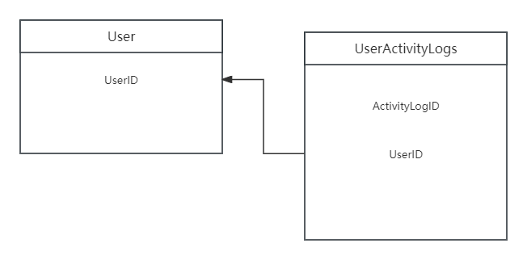

# 关系模式图说明文档

在此给出关系模式图，都放到一个图里面太大了，所以分开放。

每个图都只放和这个表相关的内容。

## NotificationLogs

仅有一条外键与别的表关联。为了清楚地显示只写了一部分表的属性并且连到了更深的位置。

## UserActivityLogs

绘制的过程中有一个问题。我本来是想把 TimeStamp 属性也作为一个外键关联的，但是我发现没有一个表的主码包含这个属性，因此只能作为一个普通的约束条件(图里面使用双箭头表示的那种)

但是这个东西我不知道在数据库中如何表示，甚至可能是不能表示的。因此，我不在图中标注这些属性。如果必要的话，应该建立一个新的时间表，专门用来记录发生事件的时间(我不知道是否有必要)

图示如下：

## RecommendationLogs

问题与 UserActivityLogs 相同

## TransactionLogs

这里出现一个大问题：

ItemID 可以关联到 FoundItems 和 LostItems。我看了一下数据库的表，这两个东西的 ID 是完全不一样的，即其外码约束的含义为：只要出现在 FoundItems 或出现在 LostItems 中均可，但是我查了一下, oracle 数据库是不允许这样的操作的。因此这个约束只能通过 Trigger 的方式触发。(GPT说的，不一定准，但是我觉得不论能不能实现，这个确实是个问题)

我不知道这样做是不是被允许的，于是我想了以下几个解决方案，各有利弊：

1. 取消 ItemID 项，改用匹配记录表中的 RecordID，但是引发一个问题：如果用户只是交易了一个物品的线索，我们的这个表应该如何记录？但是我觉得这个方案是最自然的。
2. 删除 ItemID 项，纯粹地记录交易，缺点是信息密度比现在的小。

我在这里只给出最初始的表的关系模式图，具体的解决方案(或许这个根本不是个问题？)可以讨论之后决定。

这个问题好像不是只有这个表有，可以提前看看。

