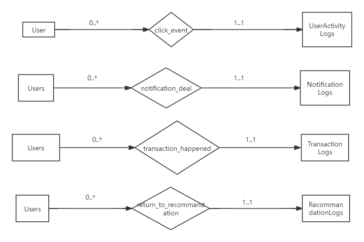

# E-R图说明文档

在这部分，我设计了两个模式，一种将我的Log部分设计为联系集，另一种将我的部分设计为实体集。

- 实体集的部分我将在下面给出我的E-R图
- 联系集部分由于涉及过多的表，且一定与其它组成员的内容大量重复，且他们的考虑一定比我周到，故不画出具体的图，但我会给出详细的画图的方式，以供组长参考。

## 实体集设计方式



这是一个最基本的E-R图，没有列出属性。

图上可能有更多的关系，例如 UserActivityLogs，可能与更多的表关联。但是有一个重要的问题，一条日志和一个操作对应，但是这个操作的类型是多样的。因此，不知道向图中添加哪个关联的元素。所以我认为添加是不合理的，如果有不同的看法或建议可以讨论。

其它表类似，有的找不出关联的关系，有的和上述问题相同。

## 联系集设计方式

**p.s.** 在下图中，[]代表矩形(实体集)，<>代表菱形(联系集)

需要进行判断：

- 如果涉及到用户的金钱操作，则以 UserTransactionLogs 作为联系集
- 其余情况，如果涉及到用户对通知的处理，则以 NotificationLogs 作为联系集
- 其余情况，如果涉及到用户对推荐内容的处理，则以 RecommandationLogs 作为联系集
- 其余所有用户操作(非管理员用户的剩余的所有操作)，都以 UserActivityLogs 作为联系集
- 如果有的内容没有一个表与之关联，则使用以上的实体集设计方式

(联系集内部需要改名字，例如用户操作什么的)

~~但是辛苦组长找一下对应的关系，标一下上面的0..*之类的内容~~

最终效果如下:

```text
[user] <用户操作/用户交易/......> [另外的表]
```

个人倾向于联系集的实现。

## 在设计关系模式图的时候发现了新的问题

解决的想法：LostItem 和 FoundItem 之间的联系集是 TranssactionLogs
