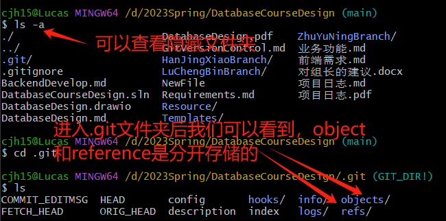
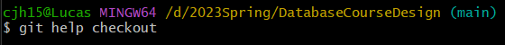
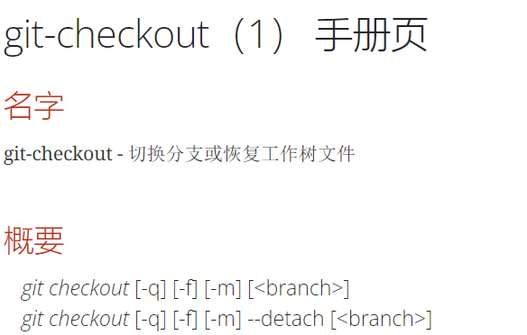
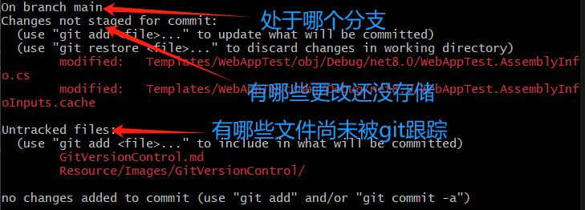

  
## 在git中，文件、文件夹、commit都是怎么组成的？
### 文件(blob)
typeof(blob) = array<byte> -> **一个文件是bit组成的数组**  
### 文件夹(tree)
typeof(tree) = map<string, tree | blob> -> 文件夹实际上是一个字典/哈希图；string代表文件名，tree|blob代表这个名下的文件/文件夹的内容
### **commit**
typeof(commit) = struct{
     parents = array<commit> # 代表该commit的历史记录,数组形式存储  
     author,message等meta data
     snapshot = tree
}

## git是如何处理这三种数据结构的
### git**平等对待上述的数据结构**
type object = blob | tree | commit -> 数据类型object就是“平等”的体现  
ObjectStorage = map<string,object>  
如果把文件/文件夹/commit提交到ObjectStorage，**实际上是对字典/哈希表进行添加操作**，写入到硬盘里；取文件就跟从哈希表里取是一样的  

reference = map<string,string> -> reference实现的是**人能看得懂的**文件名到**16进制的文件哈希值**的映射关系  

### git仓库的组成
  

# git指令
## `git help` 
输入`git help ...`(...代表对哪个git指令进行提问)  
图片中对`checkout`指令进行提问  
  
输入后会打开一个操作指南窗口  
  

## `git status`
该指令可以查询当前我的git状态  
  

`git add`和`git commit`指令操作大家应该都会这里不细讲，重点讲**commit信息里写什么**  
## git commit message  