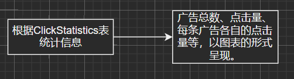
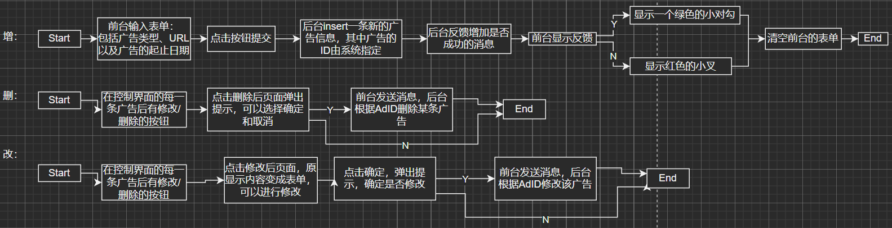
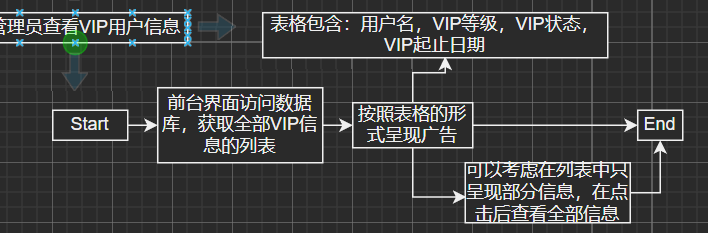
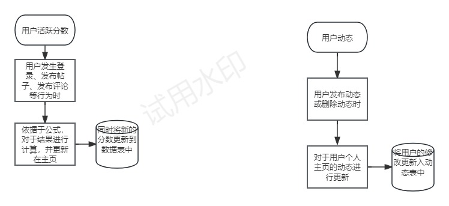
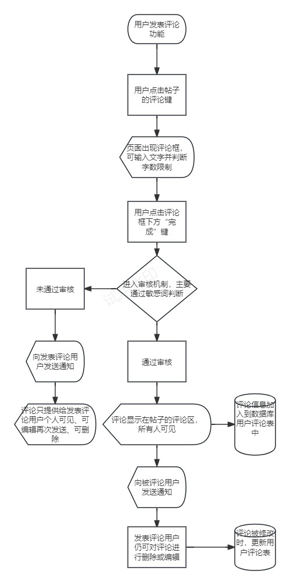
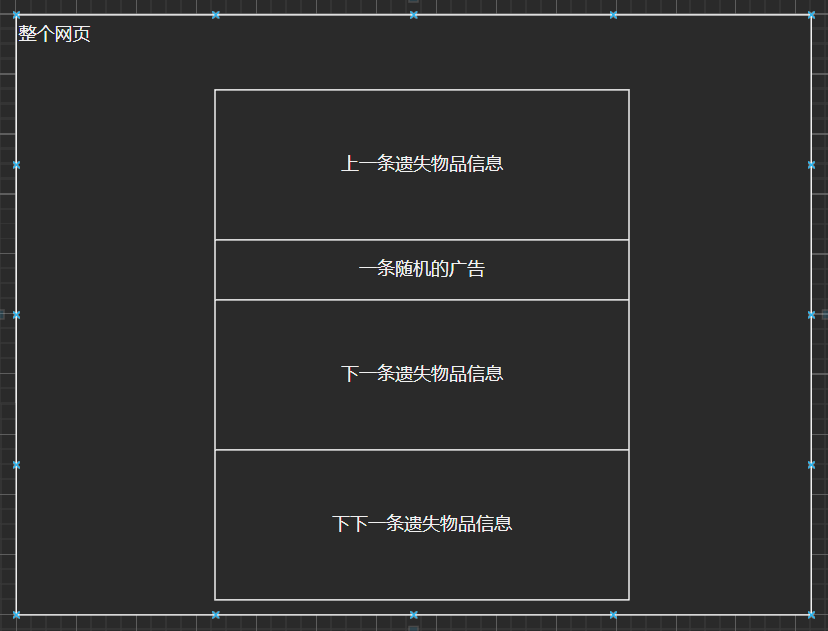

# 数据库表的修改与添加汇总
## 广告功能
### 添加

- 表名：**Advertisements**（广告信息表）
	
	| 字段名      | 数据类型     | 描述         |
	| ----------- | ------------ | ------------ |
	| AdID        | int          | 主键，广告ID |
	| AdContent   | varchar(255) | 广告内容     |
	| AdURL       | varchar(255) | 广告链接     |
	| AdType      | varchar(50)  | 广告类型     |
	| AdStartDate | datetime     | 广告开始日期 |
	| AdEndDate   | datetime     | 广告结束日期 |
	
- 表名：**AdClickStatistics**（点击统计表）

| 字段名    | 数据类型    | 描述                 |
| --------- | ----------- | -------------------- |
| ClickID   | int         | 主键，点击记录ID     |
| AdID      | int         | 外键，被点击的广告ID |
| UserID    | int         | 外键，点击用户的ID   |
| ClickTime | datetime    | 点击时间             |
| IPAddress | varchar(50) | 点击用户的IP地址     |

## VIP功能
### 添加
- **VIPMembers**（**VIP会员信息表**）

| 字段名       | 数据类型    | 描述                                |
| ------------ | ----------- | ----------------------------------- |
| VIPMemberID  | int         | 主键，VIP会员ID                     |
| UserID       | int         | 外键，关联用户ID                    |
| VIPStartDate | datetime    | VIP会员开始日期                     |
| VIPEndDate   | datetime    | VIP会员结束日期                     |
| VIPLevel     | int         | VIP会员等级                         |
| Status       | varchar(20) | VIP会员状态（如正常、过期、冻结等） |
| CreatedAt    | datetime    | 创建时间                            |
| UpdatedAt    | datetime    | 更新时间                            |
- **VIP等级表（VIPLevels）**：（功能拟弃用，但如果想扩展则保留，也就是做这个表，但只有一条信息）

	| 字段名           | 数据类型     | 描述         |
	| ---------------- | ------------ | ------------ |
	| LevelID          | int          | 主键，等级ID |
	| LevelName        | varchar(50)  | 等级名称     |
	| LevelDescription | varchar(255) | 等级描述     |
	| RequiredPoints   | int          | 所需积分     |

- **VIP特权表（VIPPrivileges）**：（功能拟弃用，但如果想扩展则保留）

	| 字段名               | 数据类型     | 描述         |
	| -------------------- | ------------ | ------------ |
	| PrivilegeID          | int          | 主键，特权ID |
	| PrivilegeName        | varchar(50)  | 特权名称     |
	| PrivilegeDescription | varchar(255) | 特权描述     |
	| RequiredLevelID      | int          | 所需等级ID   |

- **VIP购买订单表（VIPOrders）**：

	| 字段名         | 数据类型      | 描述             |
	| -------------- | ------------- | ---------------- |
	| OrderID        | int           | 主键，订单ID     |
	| UserID         | int           | 外键，关联用户ID |
	| TotalAmount    | decimal(10,2) | 订单总金额       |
	| DiscountAmount | decimal(10,2) | 折扣金额         |
	| PointReturn    | int           | 积分返还量       |
	| OrderTime      | datetime      | 下单时间         |

## Q&A功能：

### 修改 

完全修改了问题表，将原来的一个问题表分解为问题表和回答表
   （1）问题表：
   * 问题ID：主键
   * 关联物品ID：外键，连接到物品信息表
   * 提问用户ID：外键，关联到用户信息表
   * 提出问题内容：记录提问的文本内容
   * 提问日期：记录提问的日期（此处用于显示）
   * 订阅用户ID：外键，关联到用户信息表
 （2）回答表
   * 回答ID：主键
   * 问题ID：外键，关联到回答表
   * 回答用户ID：外键，关联到用户信息表
   * 回答内容：记录回答的文本信息
   * 回答日期：记录回答的日期

## 用户交互功能：

### 修改

1. 在用户动态表中增加热度栏
2. 修改了用户活跃度表，新表显示用户活跃度增加或减少信息，包括：
* 活跃度ID：主键
  * 用户ID：外键，关联到用户信息表
  * 活跃分数：一般为正整数，表示该条目增加的活跃度

## 用户发表评论功能

- ItemComments(物品评论表)（没有修改）
    - `CommentID` (评论ID): 主键，系统自动生成。
    - `ItemID` (物品ID): 评论关联的物品ID，外键，关联到`LostItems`或`FoundItems`表
    - `UserID` (用户ID): 评论者的用户ID，外键，关联到`Users`表
    - `Content` (评论内容): 用户指定。
    - `CommentDate` (评论日期): 系统生成

## 活跃程度显示

### 修改

- UserActivity(用户活跃度表)
	- **活跃度ID** (ActivityID): 唯一标识每条活跃度记录的主键。
	- **用户ID** (UserID): 用户的ID，外键，关联到Users表的UserID。
	- ~~**登录次数** (LoginCount): 用户登录平台的次数。~~(**拟弃用，4.25**)
	- **活跃行为** (ActionID):对于评论、发帖、点赞等行为种类的标识
	- ~~**最后登录日期** (LastLoginDate): 用户最后一次登录的日期。~~(**拟弃用，4.25**)
	- **活跃分数** (ActivityScore): 基于用户活动计算的活跃度分数。
- UserPoints~~(用户积分表)~~（用户整体活跃度表）
	- ~~**积分ID** (PointID): 唯一标识每个积分记录的主键。~~(**拟弃用，4.25**)
	- **用户ID** (UserID): 用户的ID，外键，关联到Users表的UserID。
	- ~~**积分来源** (PointSource): 积分获取的来源，如“物品报失登记”、“成功找回物品”等。~~(**拟弃用，4.25**)
	- **整体活跃度** (Points): 当前整体活跃度。(**拟更改，4.25**)
	- **日期** (Date): 活跃度变更的日期。(**拟更改，4.25**)
- UserFeeds(用户动态表)
	- **动态ID** (FeedID): 唯一标识每条动态的主键。
	- **用户ID** (UserID): 发布动态的用户ID，外键，关联到Users表的UserID。
	- **内容** (Content): 动态的具体内容。
	- **发布日期** (PublishDate): 动态发布的日期。
# 功能及流程图

## 广告功能

（有源drawio）

1. 管理员控制界面呈现广告条目

2. 管理界面广告信息统计

3. 管理员增删改广告

4. 管理员查找广告

5. 用户界面呈现广告

## VIP功能

（有源drawio）

1. 管理员查看VIP用户信息

2. 管理员查找用户VIP信息

3. 管理员（更高级）增删改用户VIP信息

4. 用户充值VIP

5. 用户界面显示VIP特效

## 用户交互功能

**（仔细查看直接看原图）**

## Q&A功能

## 显示用户活跃程度功能

### 业务详细说明

#### 1. 业务基础功能

- 评估用户的活跃程度，依据于是否每日登录、近期发表评论的次数、近期发表帖子数量
- 记录用户积分，积分主要通过成功找回物品或成功找到失主来得到
- 记录用户动态，动态包括评论及帖子发布

#### 2. 业务可选功能

- 用户可设置是否允许他人查看动态、积分、活跃程度等内容

### 业务具体实现

#### 1. 用户活跃程度

- 活跃分计算公式：七天内登录天数 * 1 + 七天内发表评论的次数 * 3 + 一个月内发表帖子的数量 * 10
- 当用户登录、用户发表评论、用户发表帖子情况发生时，更新用户活跃分记录表

#### 2. 用户积分记录

- 用户积分公式：发表找失主或找失物的帖子的个数 * 1 + 成功找回失物或成功找到失主的个数 * 5
- 当用户发生以上情况时更新用户积分表

#### 3. 用户动态记录

- 用户动态包括：用户发表的评论、用户发布的帖子
- 用户发生以上行为时更新用户动态记录表
- 用户动态在用户个人主页显示

### 流程图

## 用户发表评论功能

### 业务详细说明

#### 1. 业务基础功能

- 在发布的失物找失主或者失主找失物的帖子下面，用户可以发表不超100字的文字评论
- 评论正式发布后需向被评论贴的发布用户进行通知
- 审核后评论以时间顺序排列在帖子下方
- 评论需显示发表评论用户的头像昵称
- 对于用户的评论进行评论
- 发表评论的用户发表后可删除

#### 2. 业务可选功能

- 评论的审核机制
- 可由用户自行选择时间上由新到旧、由旧到新

### 业务实现逻辑

#### 1. 用户点击评论发表前

- 为用户提供发表评论入口（评论按键及评论框等）
- 评论打字时检查字数限制,达到100时发出提示

#### 2. 用户点击发表按键后

- 敏感词审核机制（可选）
- 将该条评论的信息更新入数据库表中
- 提供方法使得评论显示出来
- 提供方法使得被评论用户接收通知
- 如果用户是对评论进行评论，那么评论内容中自动出现@xxx

#### 3. 帖子下方显示出评论

- 发表评论用户可删除评论
- 其他用户选择评论的排序方式（可选）

### 流程图

# 第一小组前端需要

## VIP功能

- VIPInformation.html：用于显示所有VIP信息列表（管理员可见）

- VIP用户特效（红名或者小皇冠标记，暂定红名）
- 普通用户/VIP用户界面上需显示充值/续费的按钮
- VIPCharge.html：VIP充值界面（提供充值时长，并且需要连接充值接口）

## 广告功能

- AdInformation.html：显示所有广告列表（管理员可见）

- AdStatistics.html：显示广告统计信息（管理员可见）

这些图表根据广告的点击量信息制作

- 广告显示盒子：用户界面显示广告信息

或者浮动在两边也可以。

## 用户交互功能与Q&A功能

1. 用户动态页
   * 用户信息
   * 内容信息
   * 热度信息
   * 转发数量信息
2. 用户信息页
   * 关注信息
   * 粉丝信息
   * 关系信息：关系信息中显示关系和建立关系的对象
3. 用户消息页
   * 显示整组消息
   * 单个消息显示如微信，点进会话显示消息，并且显示消息的发送时间和状态信息（已读未读等）
   * 请求信息，发送方单独设置成框状，接收方相同设置 但是加上同意和拒绝选项
   * 用户可以通过图标进入消息页面，图标显示未读消息
4. 报错的弹窗信息
   * 简洁为主，设置取消的X键

## 用户发发表评论
1. 每个帖子下方都应有***评论键***
2. 点击评论键后出现***评论框***，可输入文字，但是输入框下方提供一个字数记录***80/100***，并在字数达到100时发出提醒，达到限制
3. 完成文字输入后，评论框下方有***发表键***，点击即可发表
4. 点击发表后，当前页面马上刷新，更新出本评论（如果有审核机制，则，要显示***待审核***，且仅限发表者查看）
5. （审核通过后），评论所有人可见，并且显示出***评论者的头像、昵称、评论内容、评论日期***，同时提供***评论键***（用于对该评论进行评论）
6. 评论者本人点击此评论，可出现***删除键***
7. 用户要对评论进行评论时，点击他人的评论旁的评论键，进行上述流程，但是文本中会自动出现@xxx

## 显示用户在网站活跃度
1. 活跃度及动态均在***个人主页***中查看
2. 用户可***设置他人是否可见***
3. 个人主页中***一栏为：活跃度：xx***，用于显示整体活跃度
4. 用户点击这个后，出现近期每条活跃度的变化，可以是***点击后活跃度栏下拉出现,也可以是一个新的网页***，每条活跃度显示出，***活跃行为，活跃度变化量（+1/-1），发生日期时间***
5. 个人主页中***一栏为：最近动态***
6. 点击该栏，则出现***用户发表的动态由最近发表到最早发表的顺序展示***，每条动态展示：***动态种类（评论/帖子），动态内容，发布时间***
7. 点击每条动态，都能打开***对应帖子所在网页***，并对***动态内容进行加亮处理***
