# 功能及流程图

## 广告功能

（有源drawio）

1. 管理员控制界面呈现广告条目

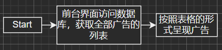

2. 管理界面广告信息统计

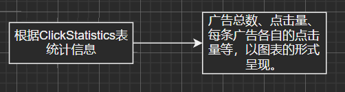

3. 管理员增删改广告

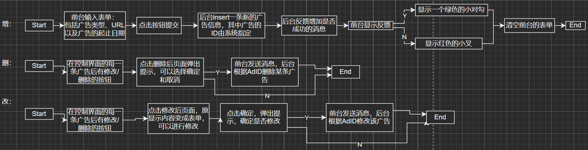

4. 管理员查找广告

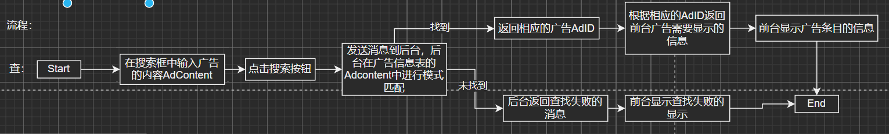

5. 用户界面呈现广告

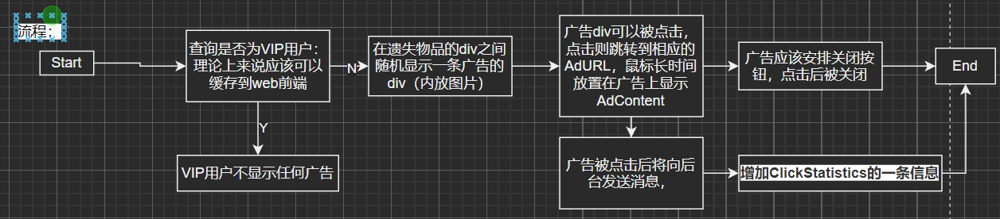

## VIP功能

（有源drawio）

1. 管理员查看VIP用户信息

2. 管理员查找用户VIP信息

3. 管理员（更高级）增删改用户VIP信息

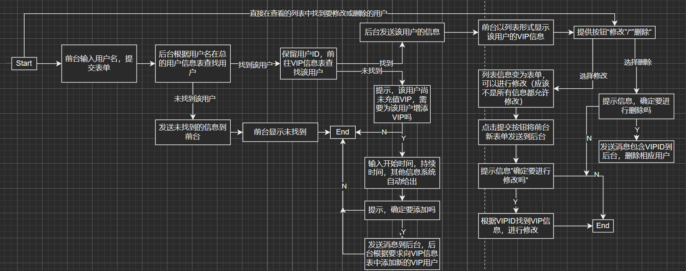

4. 用户充值VIP

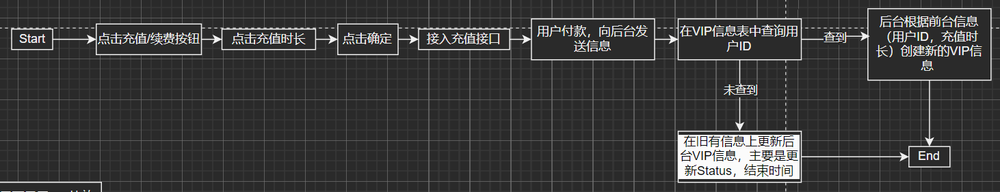

5. 用户界面显示VIP特效

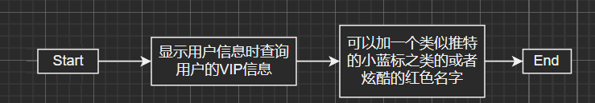

## 用户交互功能

**（仔细查看直接看原图）**

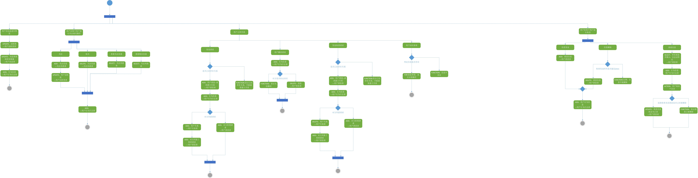

## Q&A功能

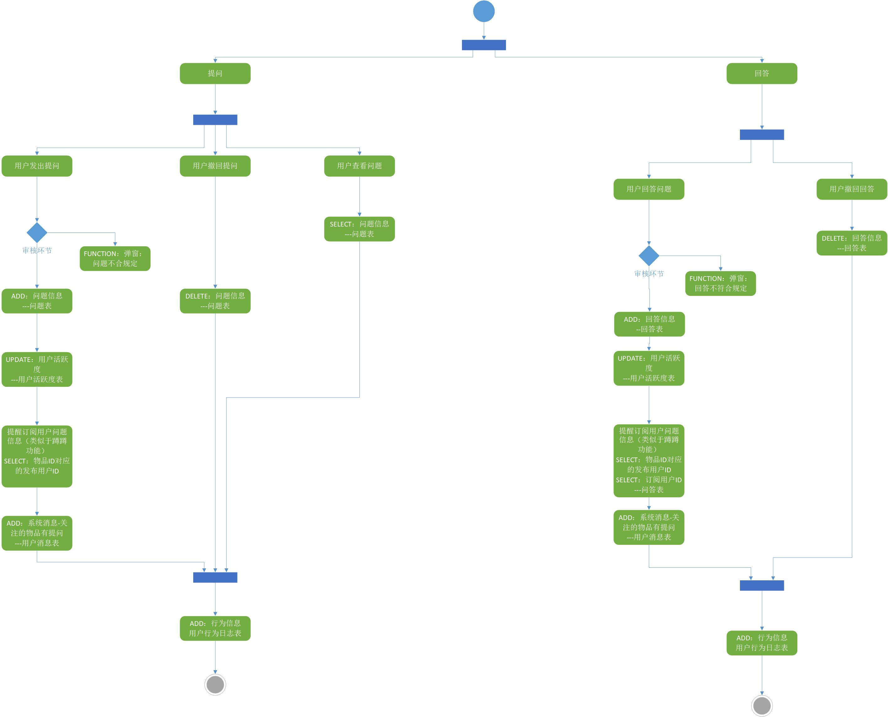

## 显示用户活跃程度功能

### 业务详细说明

#### 1. 业务基础功能

- 评估用户的活跃程度，依据于是否每日登录、近期发表评论的次数、近期发表帖子数量
- 记录用户积分，积分主要通过成功找回物品或成功找到失主来得到
- 记录用户动态，动态包括评论及帖子发布

#### 2. 业务可选功能

- 用户可设置是否允许他人查看动态、积分、活跃程度等内容

### 业务具体实现

#### 1. 用户活跃程度

- 活跃分计算公式：七天内登录天数 * 1 + 七天内发表评论的次数 * 3 + 一个月内发表帖子的数量 * 10
- 当用户登录、用户发表评论、用户发表帖子情况发生时，更新用户活跃分记录表

#### 2. 用户积分记录

- 用户积分公式：发表找失主或找失物的帖子的个数 * 1 + 成功找回失物或成功找到失主的个数 * 5
- 当用户发生以上情况时更新用户积分表

#### 3. 用户动态记录

- 用户动态包括：用户发表的评论、用户发布的帖子
- 用户发生以上行为时更新用户动态记录表
- 用户动态在用户个人主页显示

### 流程图

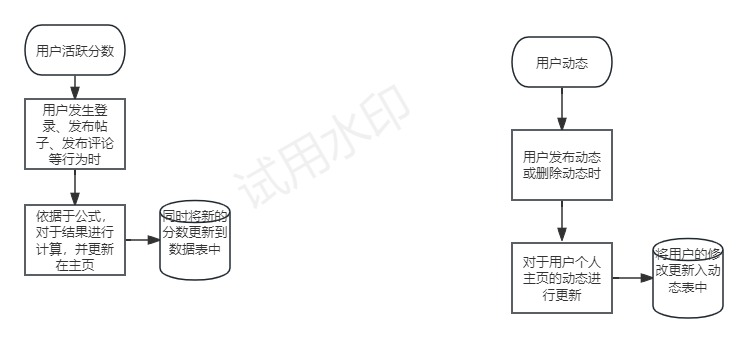

## 用户发表评论功能

### 业务详细说明

#### 1. 业务基础功能

- 在发布的失物找失主或者失主找失物的帖子下面，用户可以发表不超100字的文字评论
- 评论正式发布后需向被评论贴的发布用户进行通知
- 审核后评论以时间顺序排列在帖子下方
- 评论需显示发表评论用户的头像昵称
- 对于用户的评论进行评论
- 发表评论的用户发表后可删除

#### 2. 业务可选功能

- 评论的审核机制
- 可由用户自行选择时间上由新到旧、由旧到新

### 业务实现逻辑

#### 1. 用户点击评论发表前

- 为用户提供发表评论入口（评论按键及评论框等）
- 评论打字时检查字数限制,达到100时发出提示

#### 2. 用户点击发表按键后

- 敏感词审核机制（可选）
- 将该条评论的信息更新入数据库表中
- 提供方法使得评论显示出来
- 提供方法使得被评论用户接收通知
- 如果用户是对评论进行评论，那么评论内容中自动出现@xxx

#### 3. 帖子下方显示出评论

- 发表评论用户可删除评论
- 其他用户选择评论的排序方式（可选）

### 流程图

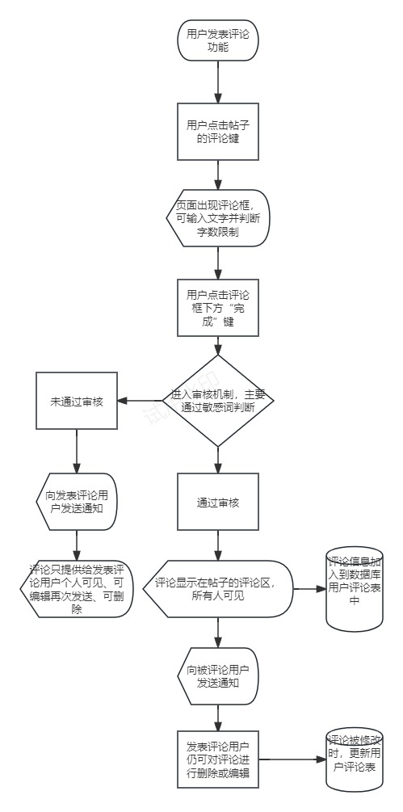
