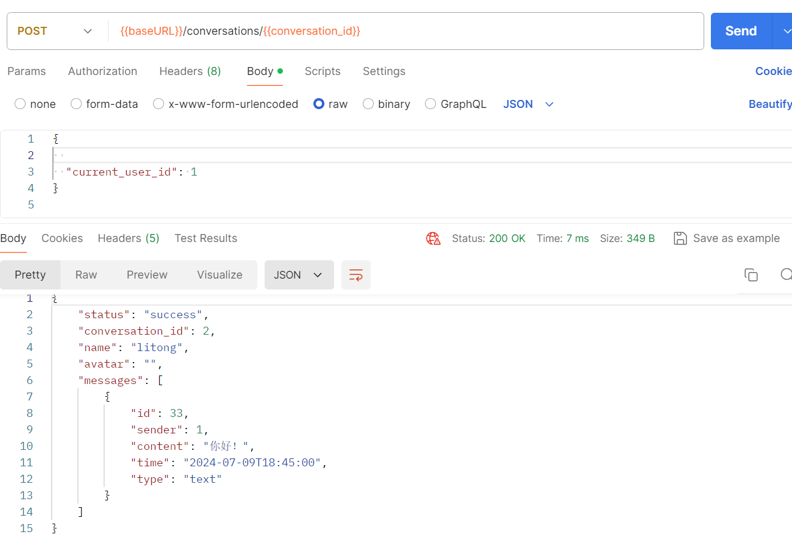
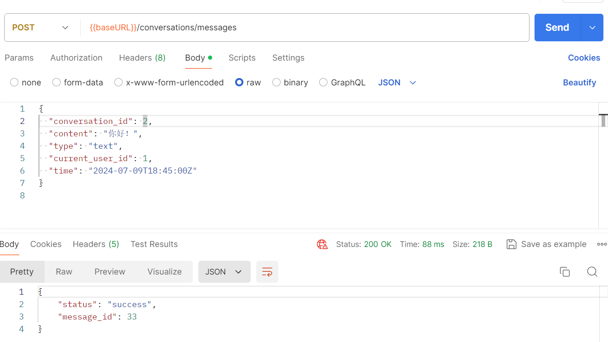
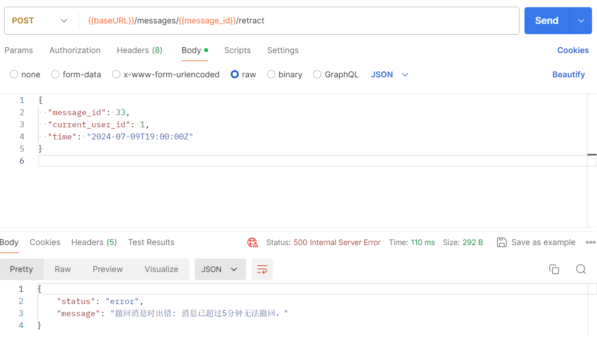

## 问题与回答模块
### 查看
1. 查看问题

2. 查看回答

### 更改
1. 提出问题

2. 回答问题

3. 撤回回答

4. 撤回问题

## 用户动态模块

### 查看
1. 查看特定用户动态
 

2. 查看推荐动态

### 更改
1. 用户转发动态
动态不存在：未找到帖子
动态存在：转发动态

2. 用户创建帖子

3. 用户撤回帖子
帖子存在：成功删除
帖子不存在：报错500 删除无效

## 用户关注模块
### 查看
1. 查看关注列表
   
2. 查看粉丝列表
   
3. 查看对指定用户的关注状态
   
### 更改
1. 进行关注和取关的操作
   

## 用户聊天模块
### 查看
1. 查看会话列表
   
2. 查看指定会话的所有消息
   
### 更改
1. 发送信息
   
2. 撤回信息
   
3. 进入会话更新所有离线消息的阅读状态
   
4. 更新一条指定消息的阅读状态
   