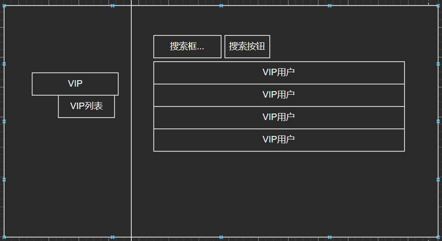

# 第一小组前端需要

## VIP功能

- VIPInformation.html：用于显示所有VIP信息列表（管理员可见）

- VIP用户特效（红名或者小皇冠标记，暂定红名）
- 普通用户/VIP用户界面上需显示充值/续费的按钮
- VIPCharge.html：VIP充值界面（提供充值时长，并且需要连接充值接口）

## 广告功能

- AdInformation.html：显示所有广告列表（管理员可见）

- AdStatistics.html：显示广告统计信息（管理员可见）

这些图表根据广告的点击量信息制作

- 广告显示盒子：用户界面显示广告信息

或者浮动在两边也可以。

## 用户交互功能与Q&A功能

1. 用户动态页
   * 用户信息
   * 内容信息
   * 热度信息
   * 转发数量信息
2. 用户信息页
   * 关注信息
   * 粉丝信息
   * 关系信息：关系信息中显示关系和建立关系的对象
3. 用户消息页
   * 显示整组消息
   * 单个消息显示如微信，点进会话显示消息，并且显示消息的发送时间和状态信息（已读未读等）
   * 请求信息，发送方单独设置成框状，接收方相同设置 但是加上同意和拒绝选项
   * 用户可以通过图标进入消息页面，图标显示未读消息
4. 报错的弹窗信息
   * 简洁为主，设置取消的X键

1. # 用户发表评论

	1. 每个帖子下方都应有***评论键***

	2. 点击评论键后出现***评论框***，可输入文字，但是输入框下方提供一个字数记录***80/100***，并在字数达到100时发出提醒，达到限制

	3. 完成文字输入后，评论框下方有***发表键***，点击即可发表

	4. 点击发表后，当前页面马上刷新，更新出本评论（如果有审核机制，则，要显示***待审核***，且仅限发表者查看）

	5. （审核通过后），评论所有人可见，并且显示出***评论者的头像、昵称、评论内容、评论日期***，同时提供***评论键***（用于对该评论进行评论）

	6. 评论者本人点击此评论，可出现***删除键***

	7. 用户要对评论进行评论时，点击他人的评论旁的评论键，进行上述流程，但是文本中会自动出现@xxx 

		UI：

	# 显示用户在网站活跃度

	1. 活跃度及动态均在***个人主页***中查看
	2. 用户可***设置他人是否可见***
	3. 个人主页中***一栏为：活跃度：xx***，用于显示整体活跃度
	4. 用户点击这个后，出现近期每条活跃度的变化，可以是***点击后活跃度栏下拉出现,也可以是一个新的网页***，每条活跃度显示出，***活跃行为，活跃度变化量（+1/-1），发生日期时间***
	5. 个人主页中***一栏为：最近动态***
	6. 点击该栏，则出现***用户发表的动态由最近发表到最早发表的顺序展示***，每条动态展示：***动态种类（评论/帖子），动态内容，发布时间***
	7. 点击每条动态，都能打开***对应帖子所在网页***，并对***动态内容进行加亮处理*** UI：
