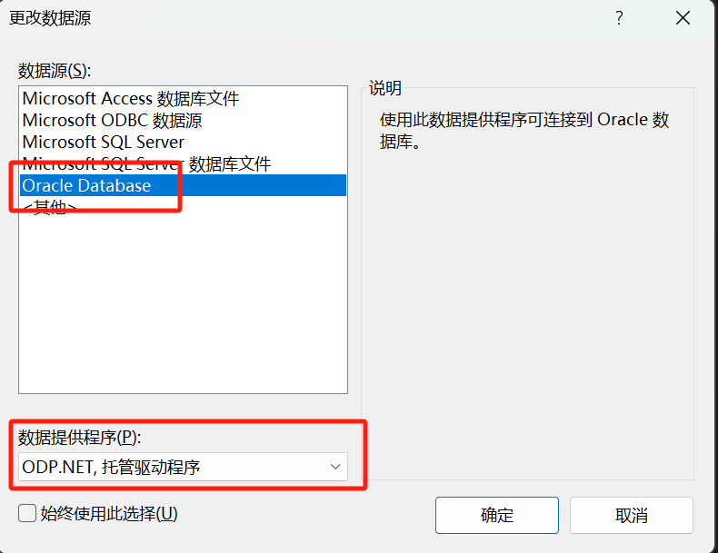

# How_to_Connect_to_Database 

# via VSCode and Visual Studio

> Written by LCB 2024.7.8

**<span style="color:red">由于本文档涉及到服务器的核心敏感数据，故切勿外传！！！</span>**

## 0x00 Intro

本文档将基于VSCode和VS介绍如何连接至Oracle Database，需要用到的基础信息如下：

```
服务器信息：(一般用不到，服务器会由lcb统一维护)
ip : 121.36.200.128
username : oracle
passwd : Lcbbcl321.
----------------------
Oracle信息：
hostname : 121.36.200.128
port : 1521
Service name : ORCL
(SYSDBA角色)
Username : SYS
Passwd : Lcbbcl321
```

## 0x01 VSCode 插件安装

1. 在VSCode中，请安装 **`Oracle Developer Tools for VS Code (SQL and PLSQL)`**


2. 安装完毕后，重启VSCode，此时在左侧会出现如下图标，点击进入：


3. 并点击如图中的 **`+`** 键，新建一个连接实例，如下图填写，并点击下方的**`Create Connection`**


> 注：开发初期并没有进行角色的划分，默认使用SYSDBA连接，请大家在对数据库进行操作前三思。

4. 创建后可以在左侧的DATABASE中看见连接实例，双击即可连接，初次连接时需要输入密码，同样为**`Lcbbcl321`**


5. 连接完成。

   

## 0x02 Visual Studio 2022 插件安装

> 写到这，想到冷笑话一则：某次LCB去参加一个创新创业比赛答辩，老师问：你看Visual Studio和Visual Studio Code 的前缀都一样，他们不就是一个软件吗？（基于作者真实经历改编）

1. 首先，下载ODAC for VS 2022：（本文件已提供在微信群内）

[ODAC for VS 2022](https://marketplace.visualstudio.com/items?itemName=OracleCorporation.OracleDeveloperToolsForVisualStudio2022)

2. 下载完毕后双击安装即可。
3. 安装完毕打开VS 2022，在上方 **工具-连接到数据库**


4. 初次连接需要初始化配置，请选择“是”


5. 插件可能会更新，关闭所有VS 2022进程后，选择更新即可


6. 更新完毕再次打开VS 2022，继续配置



请注意核对配置：选择**“Oracle Database - ODP.NET, 托管驱动程序”**

7. 如图配置：


8. 连接完成


## 0x03 后记

本文只是介绍了如何使用软件连接到服务器，至于如何使用C#连接数据库，请后端开发同学自行学习，可以搜索：C# 使用ODP.NET连接 之类的关键词，或参考以下u2b视频：
[How to connect C# to SQL (the easy way)](https://www.youtube.com/watch?v=Et2khGnrIqc)