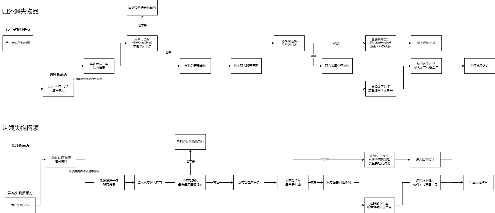

## 第一周:发布寻物启事和无主物品前后端

本周，我们主要完成了发布寻物启事和无主物品的前后端及其有关api，主要涉及物品信息的发布，后端物品的回显，图片的上传等功能，详细接口如下：

1. 发布寻物启事 (Lost Item)
   - API 路径: `api/PublishItem/Lost`
   - 方法: POST
   - 功能: 接收前端传入的寻物启事信息，包括物品详情和可选的悬赏信息
   - 主要处理: 解析JSON数据，创建Lost_Item和Reward_Offers对象，调用业务逻辑层方法保存数据
2. 发布无主物品 (Found Item)
   - API 路径: `api/PublishItem/Found`
   - 方法: POST
   - 功能: 接收前端传入的无主物品信息
   - 主要处理: 解析JSON数据，创建Found_Item对象，调用业务逻辑层方法保存数据
3. 查询物品信息
   - API 路径: `api/QueryItem`
   - 方法: GET
   - 功能: 根据类型（丢失/找到）和审核状态查询物品信息
   - 主要处理: 接收查询参数，调用业务逻辑层方法查询数据，返回JSON格式的查询结果
4. 删除物品信息
   - API 路径: `api/DeleteItem`
   - 方法: DELETE
   - 功能: 根据物品ID删除特定的物品信息
   - 主要处理: 接收删除请求的JSON数据，解析物品ID和类型，调用业务逻辑层方法删除数据

## 第二周:个人中心界面、将前后端部署至服务器、个性化设置后端

### 个人中心界面和个人中心界面中查看用户自己发布的寻物启事和无主物品前端

在此部分中，我们实现了一个初步的个人中心页面，在页面里，用户可以查看自己发布的发布的寻物启事和无主物品，并预设了一些个性化设置，由于此块后端及api已在上周完成，故主要涉及前端部分：

1. 查看用户发布的寻物启事

   - 使用 Ant Design Vue 的 Table 组件展示寻物启事列表

   - 显示内容包括：物品名称及类别、描述、遗失地点、丢失时间、物品标签、图片、悬赏信息等

   - 实现了删除功能，可以删除单条寻物启事

   - 使用 axios 从后端 API 获取数据

2. 查看用户发布的无主物品

   - 同样使用 Ant Design Vue 的 Table 组件展示无主物品列表

   - 显示内容包括：物品名称及类别、描述、发现地点、发现时间、物品标签、图片等

   - 使用 axios 从后端 API 获取数据

### 将前后端部署至服务器

本周的重要内容是将前后端部署至服务器，简单来说，在服务端使用了 .NET SDK 8.0来进行C#程序的运行，而前端则通过nodejs+vue的方式支持。详细部署方式可见本日志同目录下的`如何将前后端部署至服务器.pdf`

### 个性化设置后端

由于部分个性化设置需要涉及其他小组开发的内容，故本周只进行了个性化设置的后端完善：

1. 用户偏好设置（User Preferences）
   - 实现了`UserPreferencesBasic`方法，用于插入新的用户偏好选择
   - 支持的字段包括：Preference_ID, User_ID, Preference_Type, Preference_Value, Release_Date
   - 使用基础SQL操作类`BasicSQLOps`进行数据插入
2. 用户订阅设置（User Subscriptions）
   - 实现了`UserSubscriptionsBasic`方法，用于插入新的用户订阅信息
   - 支持的字段包括：Subscription_ID, User_ID, Subsciption_Type, Subsciption_Status, Release_Date
   - 同样使用`BasicSQLOps`进行数据插入
3. 通用查询功能
   - 实现了`QueryItem`方法，支持查询User_Preferences和User_Subscriptions表
   - 支持无条件查询（返回表中所有数据）和有条件查询
   - 使用参数化查询以提高安全性和性能
4. 更新功能
   - 实现了`UpdateItem`方法，支持更新User_Preferences和User_Subscriptions表中的数据
   - 支持多字段同时更新
   - 使用参数化查询，支持复杂的更新条件
5. 数据库连接管理
   - 使用`Connection`类管理数据库连接
   - 支持自定义连接参数（UID, Password, DataSource）
6. 错误处理和日志记录
   - 所有方法都返回Tuple<bool, string>，包含操作是否成功的标志和错误信息
   - 使用Debug.WriteLine记录关键操作和错误信息，便于调试和维护

## 第三周:发布寻物启事和无主物品的审核前后端、服务器图片回显

### 发布寻物启事和无主物品的审核前后端

本周新增了发布物品的审核功能，具体实现如下：

**后端开发详细说明**

1. 数据访问层 : 

   a. QueryItem 方法:

   - 支持查询 Lost_Items 和 Found_Items 表
   - 使用参数化查询防止 SQL 注入
   - 对于 Lost_Items，额外关联了 REWARD_OFFERS 表以获取悬赏信息
   - 查询结果序列化为 JSON 格式返回

   b. ReviewItem 方法:

   - 支持批量审核，使用 IN 子句实现
   - 更新指定物品的 REVIEW_STATUS 为 1（通过）
   - 返回受影响的行数，用于验证操作是否成功

   c. DeleteItem 方法:

   - 支持根据 ITEM_ID 删除指定物品
   - 使用参数化查询确保安全性
   - 返回删除操作的结果和可能的错误信息

2. 控制器层: 

   a. QueryItem API:

   - 路由: GET `/api/QueryItem`
   - 参数: type (0 为 Lost_Item, 1 为 Found_Item), review (审核状态)
   - 返回 JSON 格式的查询结果或错误信息

   b. ReviewItem API:

   - 路由: POST `/api/PassItem`
   - 接收 JSON 格式的请求体，包含 ITEM_ID 和 type
   - 调用 PublishItem.ReviewItem 方法进行审核
   - 返回审核结果或错误信息

   c. DeleteItem API:

   - 路由: DELETE `/api/DeleteItem`
   - 接收 JSON 格式的请求体，包含 ITEM_ID 和 type
   - 调用 PublishItem.DeleteItem 方法删除物品
   - 返回删除结果或错误信息

**前端开发详细说明**

1. 寻物启事审核页面: 

   a. 数据获取:

   - 使用 axios 调用 `/api/QueryItem` 接口获取待审核物品
   - 在 onMounted 钩子中初始化数据

   b. 数据处理:

   - 使用 ref 来管理响应式数据 (unreviewLostItems)
   - 实现 tagMapping 和 categoryMapping 对象，用于数据显示转换

   c. UI 组件:

   - 使用 Ant Design Vue 的 Table 组件展示数据
   - 自定义列渲染，如物品名称和类别、图片、标签等
   - 实现"通过"和"驳回"按钮

   d. 审核功能:

   - pass 方法: 调用 `/api/PassItem` 接口通过审核
   - reject 方法: 调用 `/api/DeleteItem` 接口驳回物品
   - 操作后刷新数据并显示提示信息

2. 无主物品审核页面 : 

   a. 数据获取和处理:

   - 与寻物启事页面类似，但 type 参数设为 1

   b. UI 组件:

   - 表格结构与寻物启事页面相似，但不包含悬赏相关列

   c. 审核功能:

   - pass 和 reject 方法的实现与寻物启事页面类似
   - 注意到 pass 方法中的 API 调用地址是空字符串，这可能是一个待修复的 bug

3. 共同特点: a. 响应式设计:

   - 使用 Vue 3 的组合式 API (setup script)
   - 利用 ref 管理响应式状态

   b. 数据转换:

   - 实现了 tagMapping 和 categoryMapping 函数，将数字 ID 转换为可读文本

   c. 错误处理:

   - 使用 try-catch 块捕获可能的错误
   - 在出错时向用户显示提示信息

   d. 用户交互:

   - 审核操作后立即刷新数据列表
   - 使用 alert 提供操作反馈

### 服务器图片回显

此外，本周还实现了重要的服务器图片回显功能，服务器的图片回显使用nginx搭建了一个静态网站，直接通过url的方式访问图片并显示在页面上，而图片的上传由后端单独实现：

1. 图片上传功能实现: 

   a. 远程上传方法 (UploadPic):

   - 路由: POST `/api/ItemPicUpload/upload`
   - 支持上传寻物启事 (Lost) 和无主物品 (Found) 的图片
   - 使用 SFTP 将图片上传到远程服务器
   - 生成唯一的文件名，防止文件名冲突
   - 返回上传后的图片 URL

   b. 本地上传方法 (UploadPicLocal):

   - 路由: POST `/api/ItemPicUpload/uploadLocal`
   - 功能类似于远程上传，但将文件保存在本地服务器
   - 主要用于开发和测试环境

   c. 共同特点:

   - 支持类型验证，只允许 "Found" 或 "Lost" 类型
   - 使用 GUID 生成唯一文件名
   - 返回统一格式的图片 URL

2. 服务器配置:

   - 使用 Nginx 搭建静态网站，用于图片回显
   - 配置了 `/DB_data/` 路径，对应上传的图片存储位置

3. 安全性考虑:

   - 使用 SSH 私钥进行远程服务器认证
   - 私钥文件存储在服务器的安全位置

4. 错误处理:

   - 包含了各种错误检查，如文件为空、类型无效、远程文件夹不存在等
   - 使用 try-catch 块捕获可能的异常，并返回相应的错误信息

5. 异步处理:

   - 使用 async/await 实现异步文件上传，提高性能

## 第四周:归还和认领物品前后端

本周实现了归还和认领物品的前后端，由于部分涉及到聊天功能，故此处仅对本组涉及到的功能进行阐述：

**后端开发详细说明**

1. 控制器层: 

   a. MatchItemOPs 方法:

   - 路由: POST `/api/ItemMatch/ClaimAndMatch`
   - 功能: 处理物品认领和匹配请求
   - 主要步骤:
     - 解析前端传来的 JSON 数据
     - 创建 Item_Claim_Processes 和 Match_Records 对象
     - 根据审核状态决定是否进行自动匹配
     - 调用 ItemMatch.AutoMatch 方法处理匹配逻辑

   b. ReadOPs 方法:

   - 路由: POST `/api/ItemMatch/Read`
   - 功能: 处理物品归还协议的阅读
   - 主要步骤:
     - 解析前端传来的 JSON 数据
     - 创建 Item_Return_Agreements 对象
     - 调用 ItemMatch.ItemReturnAgreementBasic 方法记录协议阅读

   c. ExchangeItemOPs 方法:

   - 路由: POST `/api/ItemMatch/ExchangeItem`
   - 功能: 处理物品交换请求
   - 主要步骤:
     - 解析前端传来的 JSON 数据
     - 创建 Item_Exchanges 对象
     - 调用 ItemMatch.ExchangeItem 方法处理交换逻辑

2. 业务逻辑层: 

   a. AutoMatch 方法:

   - 功能: 实现物品的自动匹配逻辑
   - 主要步骤:
     - 检查物品审核状态
     - 创建匹配记录
     - 更新物品状态

   b. ExchangeItem 方法:

   - 功能: 处理物品交换逻辑
   - 主要步骤:
     - 检查协议阅读状态
     - 创建交换记录
     - 更新物品状态

**前端开发详细说明**

1. 寻物启事页面 : 

   a. 物品列表展示:

   - 使用 Ant Design Vue 的 Table 组件
   - 实现自定义列渲染 (如物品名称、图片、标签等)
   - 支持物品归还操作

   b. 物品归还功能:

   - 实现归还模态框 (a-modal)
   - 支持填写归还留言和上传图片
   - 使用 axios 发送归还请求

2. 无主物品页面 : 

   a. 物品列表展示:

   - 使用 Ant Design Vue 的 Table 组件
   - 实现自定义列渲染
   - 支持物品认领操作

   b. 物品认领功能:

   - 实现认领模态框
   - 支持填写认领留言和上传图片
   - 使用 axios 发送认领请求