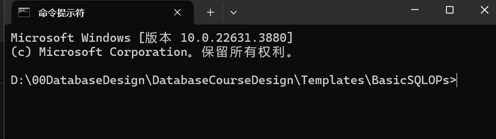
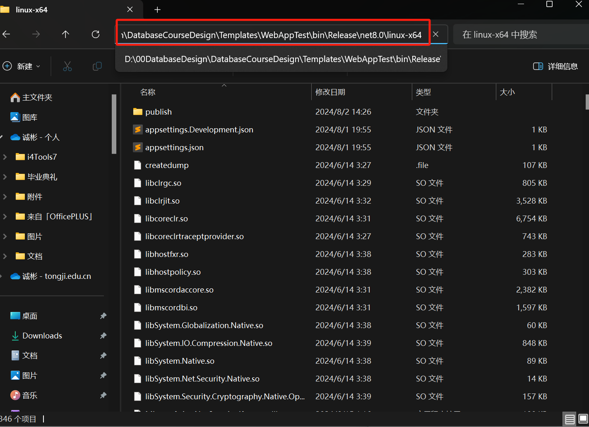

# 如何将前后端部署至服务器

> *Written by LCB 2024.8.1*

## 0x10 前期准备

在部署之前，我们先需要将前后端打包。

### 0x11 前端打包

前端打包较为简单，将front-end文件夹压缩即可，建议使用bandizip软件将其打包成.tar格式。

### 0x12 后端打包

进入Templates\BasicSQLOPs文件夹，在空白处 **`右键-在终端中打开`**：




打开后，输入这条指令即可：

```bash
dotnet publish BasicSQLOPs.sln -c Release -r linux-x64 --self-contained true
```


看见上图信息后就说明已经打包完成。

### 0x13 软件准备

下载群内的`XshellPlus-7.0.0033r-Modified-Green.zip`并解压缩，运行`!)绿化处理.bat`

运行完成后，打开文件夹内的`Xshell.exe`，会弹出如下窗口，点击**`新建`**


填入如下信息：


然后点击左侧的 **用户身份验证**，填入如下信息：


```
用户名@密码：
lcbOPer@lcblcb
zynOPer@zynzyn
hjxOPer@hjxhjx
```

然后点击下方**连接**

连接成功后可以使用 **ls **指令，可以看见已经存在一个**`WebAppTest`**文件夹，说明连接成功。


## 0x20 后端上传

在当前界面下，点击上方图示图表打开ftp终端：


打开后看见如下图界面，双击进入WebAppTest文件夹：


然后打开 **0x12** 步骤中后端打包的文件夹：`Templates\WebAppTest\bin\Release\net8.0\linux-x64`



将文件夹内内容全选后，拖入ftp终端：


等待上传完毕：


上传完成后，回到ssh界面，使用 **cd WebAppTest** 指令进入文件夹并使用 **ls** 指令查看内容：


可以看见上传成功。

然后使用 **`sudo /usr/bin/dotnet /home/zynOPer/WebAppTest/WebAppTest.dll`** 指令

（其他xxxOPer请自行替换）


注：此处由于之前测试了，所以不会要求输入密码，如果要求输入密码，输入连接时的密码即可（如：zynzyn），另外，此处输入密码是是没有回显的，相信自己，你不会输错的（玫瑰。


可以看见，已经运行在了5000端口上，为了避免端口占用，请修改`WebAppTest-Program.cs`中的如下内容：


```
用户名-端口：
lcbOPer-5001
zynOPer-5002
hjxOPer-5003
注意，请先修改再上传！
```

至此后端部署完毕，要注意的是，xshell不能关闭，不然后端会自动停止运行。

（虽然有方法让他在后台运行，但是为了防止长时间占用端口，此处不教）

## 0x30 前端部署

目前由于一些奇怪的版本问题，建议大家前端还是在本地进行运行，前端中调用的api端口改为

```
http://121.36.200.128:5001(或5002/5003)/api/xxx
```

即可。

