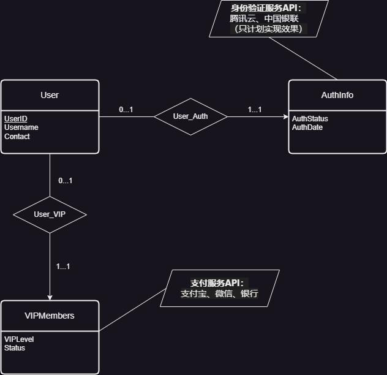
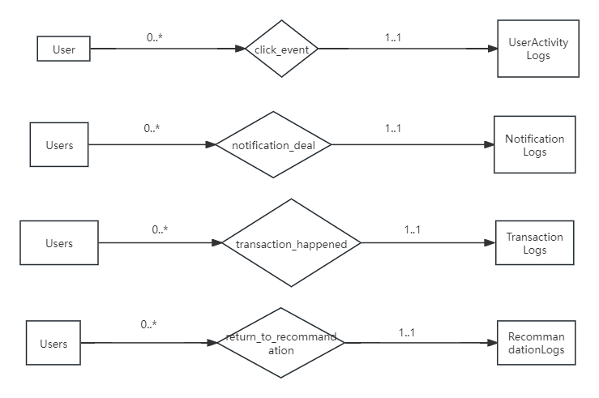
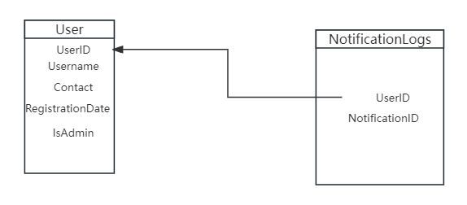
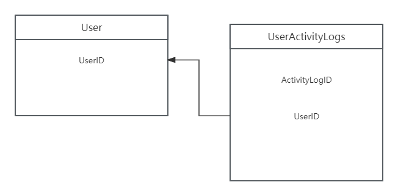
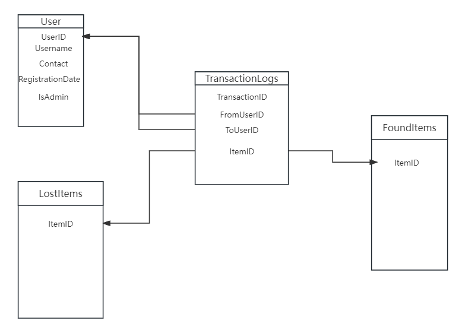
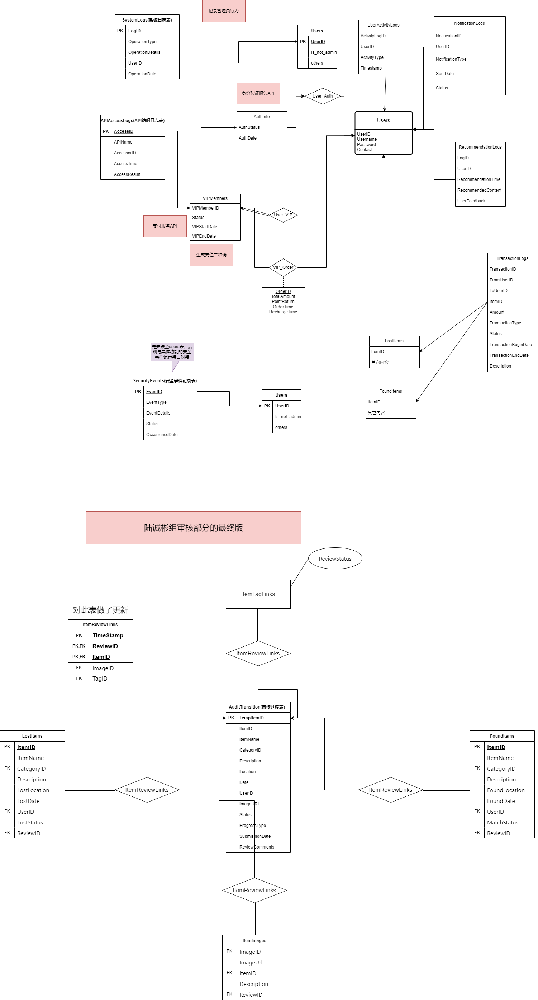

# 用户注册

## 数据库表设计

- AuthInfo(用户认证信息表)
  - **用户ID** (UserID): 关联的用户ID，外键，关联到Users表的UserID。系统指定
  - **认证状态** (AuthStatus): 当前的认证状态，如已验证、待验证等。系统认定
  - **认证日期** (AuthDate): 认证完成的日期。系统认定
  - **VIP等级**(VIPLevel): 关联用户的VIP等级，外键，关联到VipMembers表的VIPLevel。
  - **VIP状态**(Status): 关联用户的VIP认证状态，外键，关联到VIPMembers表的Status。

- Users(用户表)
  - **用户ID** (UserID): 主键，唯一标识每个用户。
  - **用户名** (Username): 用户的名称。
  - **用户密码**(Password):存储方式待定(哈希+盐值存储？)新增！！！
  - **联系方式** (Contact): 用户的联系方式。
  - **VIP等级**(VIPLevel): 关联用户的VIP等级，外键，关联到VipMembers表的VIPLevel。
  - **VIP状态**(Status): 关联用户的VIP认证状态，外键，关联到VIPMembers表的Status。

## 数据需求

* 用户注册部分主要是在验证的时候调用外部api，不需要查内部表
* 用户登录的时候需要查Users表，密码也要通过哈希和盐值来转换
* 联系方式作为其他部分的访问需要，可能会被多个部分调用
* 相关日志的记录和访问已经在用户管理部分中

## E-R图（包括外部API接口）

ps:当前仅展示用户注册部分单独涉及的 大表在最后




# 用户管理

## 功能数据需求

1. 管理员查找用户通知相关的数据需求
   - 需要用到 NotificationLogs 表，管理员提供 UserID 可以查找针对特定用户的通知，提供通知类型可以查找针对某种特定类型通知的处理情况。
2. 管理员查找用户活动的数据需求
   - 需要用到 UserActivityLogs 表，管理员提供 UserID 可以查找针对特定用户的各种活动记录，也可以通过通知类型和时间等方式限制查找的内容。
3. 管理员查找用户对推荐内容喜好的数据需求
   - 需要用到 RecommendationLogs 表，管理员提供 UserID 可以查找针对特定用户的对于推荐内容的反馈，也可以根据推荐类别查看这一类推荐的受喜好程度。
4. 管理员查找用户交易内容的数据需求
   - 需要用到 TransactionLogs 表，管理员可以提供 ItemID(待定) 查找这个特定物品的交易， 可以查找某个用户的所有交易，也可以用来统计用户消费总金额等内容。

## E-R图说明

在这部分，设计了两个模式，一种将Log部分设计为联系集，另一种将我的部分设计为实体集。

- 实体集的部分将在下面给出的E-R图
- 联系集部分由于涉及过多的表，且一定与其它组成员的内容大量重复，且他们的考虑一定比我周到，故不画出具体的图，但我会给出详细的画图的方式，以供组长参考。

### 实体集设计方式



这是一个最基本的E-R图，没有列出属性。

图上可能有更多的关系，例如 UserActivityLogs，可能与更多的表关联。但是有一个重要的问题，一条日志和一个操作对应，但是这个操作的类型是多样的。因此，不知道向图中添加哪个关联的元素。所以我认为添加是不合理的，如果有不同的看法或建议可以讨论。

其它表类似，有的找不出关联的关系，有的和上述问题相同。

### 联系集设计方式

**p.s.** 在下图中，[]代表矩形(实体集)，<>代表菱形(联系集)

需要进行判断：

- 如果涉及到用户的金钱操作，则以 UserTransactionLogs 作为联系集
- 其余情况，如果涉及到用户对通知的处理，则以 NotificationLogs 作为联系集
- 其余情况，如果涉及到用户对推荐内容的处理，则以 RecommandationLogs 作为联系集
- 其余所有用户操作(非管理员用户的剩余的所有操作)，都以 UserActivityLogs 作为联系集
- 如果有的内容没有一个表与之关联，则使用以上的实体集设计方式

(联系集内部需要改名字，例如用户操作什么的)

最终效果如下:

```text
[user] <用户操作/用户交易/......> [另外的表]
```

个人倾向于联系集的实现。

## 在设计关系模式图的时候发现了新的问题

解决的想法：LostItem 和 FoundItem 之间的联系集是 TranssactionLogs


## 关系模式图

在此给出关系模式图，都放到一个图里面太大了，所以分开放。

每个图都只放和这个表相关的内容。

## NotificationLogs



仅有一条外键与别的表关联。为了清楚地显示只写了一部分表的属性并且连到了更深的位置。

## UserActivityLogs

绘制的过程中有一个问题。我本来是想把 TimeStamp 属性也作为一个外键关联的，但是我发现没有一个表的主码包含这个属性，因此只能作为一个普通的约束条件(图里面使用双箭头表示的那种)

但是这个东西我不知道在数据库中如何表示，甚至可能是不能表示的。因此，我不在图中标注这些属性。如果必要的话，应该建立一个新的时间表，专门用来记录发生事件的时间(我不知道是否有必要)

图示如下：



## RecommendationLogs


问题与 UserActivityLogs 相同

## TransactionLogs

这里出现一个大问题：

ItemID 可以关联到 FoundItems 和 LostItems。我看了一下数据库的表，这两个东西的 ID 是完全不一样的，即其外码约束的含义为：只要出现在 FoundItems 或出现在 LostItems 中均可，但是我查了一下, oracle 数据库是不允许这样的操作的。因此这个约束只能通过 Trigger 的方式触发。(GPT说的，不一定准，但是我觉得不论能不能实现，这个确实是个问题)

我不知道这样做是不是被允许的，于是我想了以下几个解决方案，各有利弊：

1. 取消 ItemID 项，改用匹配记录表中的 RecordID，但是引发一个问题：如果用户只是交易了一个物品的线索，我们的这个表应该如何记录？但是我觉得这个方案是最自然的。
2. 删除 ItemID 项，纯粹地记录交易，缺点是信息密度比现在的小。

我在这里只给出最初始的表的关系模式图，具体的解决方案(或许这个根本不是个问题？)可以讨论之后决定。

这个问题好像不是只有这个表有，可以提前看看。




# 安全维护部分表以及E-R图

## 拟定表

### SystemLogs(系统日志表)

| 标签                        | 变量类型      | 说明                                               |
| --------------------------- | ------------- | -------------------------------------------------- |
| 日志ID (LogID)              | INT 或 BIGINT | 通常使用自增主键，确保每条记录唯一                 |
| 操作类型 (OperationType)    | VARCHAR(50)   | 存储文本描述的操作类型，如“系统维护”、“数据备份”等 |
| 操作详情 (OperationDetails) | TEXT          | 存储操作的具体详情，这可能是一个较长的文本         |
| 操作用户ID (UserID)         | DATETIME      | 存储操作发生的日期和时间                           |

### APIAccessLogs (API访问日志表)

| 标签                    | 变量类型      | 说明                                                         |
| ----------------------- | ------------- | ------------------------------------------------------------ |
| 访问ID (AccessID)       | INT 或 BIGINT | 作为主键使用，通常设为自增，以保证唯一性                     |
| API名称 (APIName)       | VARCHAR(100)  | 存储被访问API的名称或唯一标识。                              |
| 访问者标识 (AccessorID) | varchar(50)   | 存储访问者的用户ID或第三方应用ID。若访问者可以是多种类型实体，此字段需要适当设计以适配这种多态性 |
| 访问时间 (AccessTime)   | DATETIME      | 行为发生的具体时间。                                         |
| 访问结果 (AccessResult) | VARCHAR(50)   | 存储API访问的结果，如“成功”、“失败”或具体的错误代码          |

### SecurityEvents (安全事件记录表)

| 标签                      | 变量类型      | 说明                                                         |
| ------------------------- | ------------- | ------------------------------------------------------------ |
| 事件ID (EventID)          | INT 或 BIGINT | 作为表的主键，通常设为自增，保证每个安全事件具有唯一标识     |
| 事件类型 (EventType)      | VARCHAR(100)  | 描述安全事件的类型，例如“账户异常登录”、“数据泄露”等         |
| 事件详情 (EventDetails)   | TEXT          | 提供关于安全事件的详细信息，包括事件的具体描述、可能涉及的系统组件、影响范围等 |
| 处理状态 (Status)         | VARCHAR(50)   | 表示事件的当前处理状态，例如“已解决”、“待处理”等             |
| 发生日期 (OccurrenceDate) | DATE          | 事件发生的日期                                               |

### 审核过渡表

| 标签                      | 变量类型      | 说明                                                 |
| ------------------------- | ------------- | ---------------------------------------------------- |
| 临时ID (TempItemID)       | INT 或 BIGINT | 主键，系统自动生成，唯一标识每条记录                 |
| 物品ID (ItemID)           | INT 或 BIGINT | 关联的正式物品ID，为空表示新提交的物品               |
| 物品名称 (ItemName)       | VARCHAR(255)  | 用户输入的物品名称                                   |
| 类别ID (CategoryID)       | INT           | 用户选择的类别ID，关联到ItemCategories表             |
| 描述 (Description)        | TEXT          | 用户输入的描述信息                                   |
| 地点 (Location)           | VARCHAR(255)  | 用户输入的地点（遗失地点或找回地点）                 |
| 日期 (Date)               | DATE          | 用户输入的日期（遗失日期或找回日期）                 |
| 用户ID (UserID)           | INT 或 BIGINT | 提交信息的用户ID，关联到Users表                      |
| 图片URL (ImageURL)        | VARCHAR(255)  | 用户上传的图片URL                                    |
| 审核状态 (Status)         | VARCHAR(50)   | 物品的审核状态，如“待审核”、“审核通过”、“审核拒绝”等 |
| 处理类型 (ProcessType)    | VARCHAR(50)   | 标识是“遗失物品”还是“找回物品”                       |
| 提交日期 (SubmissionDate) | DATETIME      | 系统自动生成的提交日期                               |
| 审核备注 (ReviewComments) | TEXT          | 用于记录审核过程中的任何特别说明或问题               |

## E-R图设计相关说明

具体ER图见drawio文件

### SystemLogs (系统日志表)

- **实体**: SystemLogs
- 属性:
  - LogID
  - OperationType
  - OperationDetails
  - UserID
  - OperationDate
- 关系:
  - 关联到 Users 表 (通过 UserID)，记录管理员的操作。

### APIAccessLogs (API访问日志表)

- **实体**: APIAccessLogs
- 属性:
  - AccessID
  - APIName
  - AccessorID
  - AccessTime
  - AccessResult
- 关系:
  - 关联到AuthInfo表，实现身份验证服务API
  - 关联到VIPMembers，实现支付服务API和充值二维码的提供

### SecurityEvents (安全事件记录表)

- **实体**: SecurityEvents
- 属性:
  - EventID
  - EventType
  - EventDetails
  - Status
  - OccurrenceDate
- 关系:
  - 无直接的外键关系，但可以与用户表间接关联，涉及到用户安全事件（与其他同学设计的功能方面的安全问题输出关联）。

### 审核过渡表

- **实体**: AuditTransition
- 属性:
  - TempItemID
  - ItemID
  - ItemName
  - CategoryID
  - Description
  - Location
  - Date
  - UserID
  - ImageURL
  - Status
  - ProcessType
  - SubmissionDate
  - ReviewComments
- 关系:
  - 关联到陆诚彬同学审核部分的所有表 ,实现评论部分审核的过渡，完成后直接对审核状态进行更新


# 汇总大表


# 问题和更改汇总

用户注册部分：

1. 更改Users表，新加入了Password(是否存储、存储方式待讨论)用户管理部分：

用户管理部分：

1. 图上可能有更多的关系，例如 UserActivityLogs，可能与更多的表关联。但是有一个重要的问题，一条日志和一个操作对应，但是这个操作的类型是多样的。因此，不知道向图中添加哪个关联的元素。所以我认为添加是不合理的，如果有不同的看法或建议可以讨论。其它表类似，有的找不出关联的关系，有的和上述问题相同。

2. 这里出现一个大问题：

ItemID 可以关联到 FoundItems 和 LostItems。我看了一下数据库的表，这两个东西的 ID 是完全不一样的，即其外码约束的含义为：只要出现在 FoundItems 或出现在 LostItems 中均可，但是我查了一下, oracle 数据库是不允许这样的操作的。因此这个约束只能通过 Trigger 的方式触发。(GPT说的，不一定准，但是我觉得不论能不能实现，这个确实是个问题)

我不知道这样做是不是被允许的，于是我想了以下几个解决方案，各有利弊：

1. 取消 ItemID 项，改用匹配记录表中的 RecordID，但是引发一个问题：如果用户只是交易了一个物品的线索，我们的这个表应该如何记录？但是我觉得这个方案是最自然的。
2. 删除 ItemID 项，纯粹地记录交易，缺点是信息密度比现在的小。

我在这里只给出最初始的表的关系模式图，具体的解决方案(或许这个根本不是个问题？)可以讨论之后决定。

这个问题好像不是只有这个表有，可以提前看看。


