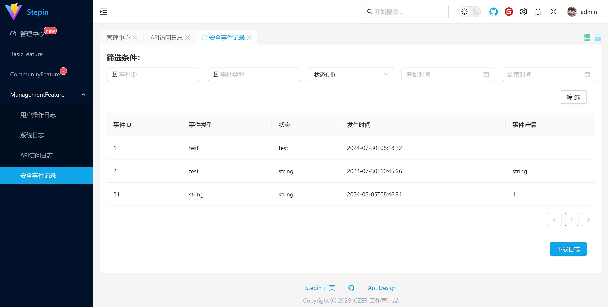

# zyn组每周进度总结

### 第一周

- 完成数据库42个表的建表工作：

 

​	==yxh与dpy：==合作完成数据库的表的创建，保证其sql查询，添加，删除等功能的顺利进行，为后端提供oracle数据库支持

实现以下功能点设计：

- 主页登录按钮设计
- 主页注册界面设计
- 登录窗口设计
- 个人主页设计
- 注销设计

#### 前端：

​	==zyn与yxh：==登录界面：输入用户名和密码，设置了若干情况的登录提示；实现了登录界面的关闭按钮的实现，主页面跳转等一系列问题，对相关路由进行了修复。

​	登录成功：

​	==zyn：==注册：由登录界面引入

​	设置若干注册输入条件：

​	设置注册提示，避免用户名重名

​	==zyn与yxh：==个人中心：实现用户信息随登录后实时更新

​	==zyn：==注销：实现用户注销，同时连接后端，清除用户信息

​	==zyn：==退出登录：清空当前前端用户信息，并回退至主界面

​	==yxh：==主页面实名认证：输入用户姓名与身份证能进行实名认证功能

#### 后端-==dpy==：

- 完成如下接口设计：
- CheckPasswordController类：
  - CheckPassword方法：
    - 路由名称：/api/CheckPassword
    - http方法：[HttpGet]
    - 传入参数：UserName (string), Password (string)
    - 功能：验证数据库中用户的用户名和密码是否匹配
- DeleteUserController类：
  - CheckPassword方法：
    - 路由名称：DeleteUser
    - http方法：[HttpGet]
    - 传入参数：UserName (string)
    - 功能：从数据库中删除指定用户名的用户
- GetUserInfoController类：
  - CheckPassword方法：
    - 路由名称：GetUserInfo
    - http方法：[HttpGet]
    - 传入参数：UserName (string)
    - 功能：获取数据库中指定用户名的用户信息
- RegisterController类：
  - InsertUser方法：
    - 路由名称：Register
    - http方法：[HttpPost]
    - 传入参数：user (RegisterUtil 类型，通过请求体传入)
    - 功能：在数据库中创建一个新用户，验证输入数据的完整性并转换为用户对象进行数据库插入操作。

### 第二周

实现以下功能点设计：

- 用户与管理员权限分配
- 用户与管理员界面分割
- 查询管理员记录日志

#### 前端：

​	==zyn：==设置管理员账号及权限：

​	没有权限的用户无法访问相应界面：

​	设置用户与管理员分离的侧边菜单栏，便于界面管理：	

​																

#### 后端-==dpy：==：

- 完成管理员日志的记录接口设计。

- InsertAPILogsController 类：
  - InsertAPILog 方法：
    - **路由名称：** `/api/InsertAPILogs`
    - **HTTP 方法：** `[HttpPost]`
    - **传入参数：** `NewLog`（类型为 `APIAccessLogsInsertUtil`，通过 `[FromBody]` 属性获取）
    - **功能：** 该方法用于在数据库中插入新的 API 访问日志。根据传入的 `NewLog` 参数，通过 `InsertAPILogsBLL` 类执行日志的插入操作。如果插入成功，则返回包含 "Successfully inserted" 的 `Ok` 结果；否则，返回包含错误信息的 `BadRequest`。

- InsertSecurityEventsController 类：
  - InsertSecurityEvent 方法：
    - **路由名称：** `/api/InsertSecurityEvents`
    - **HTTP 方法：** `[HttpPost]`
    - **传入参数：** `NewLog`（类型为 `SecurityEventsInsertUtil`，通过 `[FromBody]` 属性获取）
    - **功能：** 该方法用于在数据库中插入新的安全事件日志。根据传入的 `NewLog` 参数，通过 `InsertSecurityEventsBLL` 类执行日志的插入操作。如果插入成功，则返回包含 "Successfully inserted" 的 `Ok` 结果；否则，返回包含错误信息的 `BadRequest`。

- InsertSystemLogsController 类：
  - InsertSystemLog 方法：
    - **路由名称：** `/api/InsertSystemLogs`
    - **HTTP 方法：** `[HttpPost]`
    - **传入参数：** `NewLog`（类型为 `SystemLogsInsertUtil`，通过 `[FromBody]` 属性获取）
    - **功能：** 该方法用于在数据库中插入新的系统日志。根据传入的 `NewLog` 参数，通过 `InsertSystemLogsBLL` 类执行日志的插入操作。如果插入成功，则返回包含 "Successfully inserted" 的 `Ok` 结果；否则，返回包含错误信息的 `BadRequest`。

- InsertUserOperatorLogController 类：
  - InsertUserOpsLog 方法：
    - **路由名称：** `/api/InsertUserOperatorLog`
    - **HTTP 方法：** `[HttpPost]`
    - **传入参数：** `NewLog`（类型为 `UserOpsLogsInsertUtil`，通过 `[FromBody]` 属性获取）
    - **功能：** 该方法用于在数据库中插入新的用户操作日志。根据传入的 `NewLog` 参数，通过 `InsertUserOpsLogsBLL` 类执行日志的插入操作。如果插入成功，则返回包含 "Successfully inserted" 的 `Ok` 结果；否则，返回包含错误信息的 `BadRequest`。

### 第三周、第四周

#### 前端：

实现以下功能点设计：

- 完成四个日志：用户操作日志、系统日志、API访问日志、安全事件记录日志的以下功能：

  - 插入管理员日志信息

  - 筛选管理员表格内容

  - 下载管理员日志

​	==zyn：==**统一界面格式为：在页面上方有筛选条件，可以对记录进行个性化搜索，右下方有翻页和页数设置按钮，以及下载日志按钮可按需下载。**设置自动写入用户操作信息、API访问信息。

​	==zyn：==用户操作日志：

​	

​	==zyn：==系统日志：

​	

​	==yxh：==API访问日志：

​	==yxh：==安全事件记录：

#### 后端-==dpy==：

- GetAPILogsController 类：
  - **GetSystemLogs 方法：**
    - **路由名称：** `/api/GetAPILogs`
    - **HTTP 方法：** `[HttpGet]`
    - **传入参数：** `InputArgs`（类型为 `QueryAPIAccessLogsArgs`，通过 `[FromQuery]` 属性获取）
    - **功能：** 该方法用于从数据库中获取API访问日志。根据传入的查询参数 `InputArgs`，通过 `GetAPILogsBLL` 类来获取相应的日志数据。如果获取成功，则返回 `Ok` 结果，包含日志内容；否则，返回 `BadRequest`，并包含错误信息。

- GetSecurityEventsController 类：
  - **GetUserOpsLogs 方法：**
    - **路由名称：** `/api/GetSecurityEvents`
    - **HTTP 方法：** `[HttpGet]`
    - **传入参数：** `InputArgs`（类型为 `QuerySecurityEventsArgs`，通过 `[FromQuery]` 属性获取）
    - **功能：** 该方法用于从数据库中获取安全事件日志。根据传入的查询参数 `InputArgs`，通过 `GetSecurityEventsBLL` 类来获取相应的安全事件数据。如果获取成功，则返回包含日志内容的 `Ok` 结果；否则，返回包含错误信息的 `BadRequest`。

- GetSystemLogsController 类：
  - **GetSystemLogs 方法：**
    - **路由名称：** `/api/GetSystemLogs`
    - **HTTP 方法：** `[HttpGet]`
    - **传入参数：** `InputArgs`（类型为 `QuerySystemLogsArgs`，通过 `[FromQuery]` 属性获取）
    - **功能：** 该方法用于从数据库中获取系统日志。根据传入的查询参数 `InputArgs`，通过 `GetSystemLogsBLL` 类来获取相应的系统日志数据。如果获取成功，则返回包含日志内容的 `Ok` 结果；否则，返回包含错误信息的 `BadRequest`。

- GetUserOpsLogsController 类：
  - **GetUserOpsLogs 方法：**
    - **路由名称：** `/api/GetUserOpsLogs`
    - **HTTP 方法：** `[HttpGet]`
    - **传入参数：** `InputArgs`（类型为 `QueryUserOpsLogsArgs`，通过 `[FromQuery]` 属性获取）
    - **功能：** 该方法用于从数据库中获取用户操作日志。根据传入的查询参数 `InputArgs`，通过 `GetUserOpsLogsInfoBLL` 类来获取相应的用户操作日志数据。如果获取成功，则返回包含日志内容的 `Ok` 结果；否则，返回包含错误信息的 `BadRequest`。
- UpdateUserInfoController 类：
  - **UpdateUserInfo 方法：**
    - **路由名称：** `/api/UpdateUserInfo`
    - **HTTP 方法：** `[HttpPost]`
    - **传入参数：** `NewInfo`（类型为 `Users`，从请求体中获取）
    - **功能：** 该方法用于更新数据库中的用户信息。通过传入的 `NewInfo` 参数，调用 `UpdateUserInfoBLL` 类的 `UpdateUserInfo` 方法来执行更新操作。如果更新成功，则返回包含成功信息的 `Ok` 结果。如果更新失败则返回 `NotFound` 结果；对于其他错误信息，则返回 `BadRequest` 结果。
