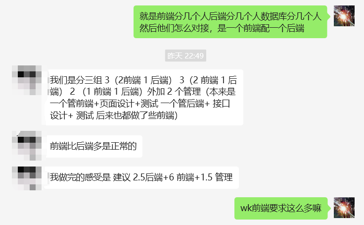

**3.30日日程**
1. 讨论数据库如何设计（依照学长的项目）
[农场项目](../../Files/FarmManagement.pdf)  
  
2. 分配工作，包括前端、后端、测试、项目整体架构、构建数据库  
  
3. 人员怎么配置（怎么合作，避免前后端合不起来）  
  
4. 前端学vue&node js，后端学C#，负责构建项目的同学把讨论结果以流程图的方式提供给前/后端同学，以便代码实现
5. 项目评分如下
  
6. 加分与扣分  
    6.1 允许摆烂**2次**，即两次 相邻开会间不推进项目  
    6.2 允许开会时人不在**2次**，但是别人替你汇报  
    6.3 上述机会用完后，**不接受任何形式请假，直接扣成绩**  
    6.4 代码需要经常返工，扣分(**因需求改变导致的反工不算**)  
    6.5 代码复用性强，结构清晰 加分  
    6.6 在完成自己的工作后辅助别人完成工作 加分  

### **4.7号前的目标**
1. 所有人配置好Oracle数据库
2. 前端人员依据这个“FrontEndDevelop”学习并配置vscode
[前端开发](../../Files/FrontEndDevelop.pdf)
3. 后端开发人员根据“.net开发文档”学习并配置vs2022
[后端开发](../../Files/BackendDevelop.pdf)
4. 确定项目布局与人员分配
5. ~~确定数据库设计思路~~

**4.7日程**
1. ~~确认所有人的Oracle数据库是否成功安装~~(zyn lrb未完成)
2. ~~确定数据库主题(目前想法是遗失物品找回)~~ (主题：遗失物品找回)

3. 准备画E-R图？

### **4.7日任务**
1. 检查数据库架构是否合理（是否有可以删除的/合并的/补充的表）
2. 找数据来源（chatgpt）
3. 准备画E-R图
4. 学习VUE

**4.14日程**
1. 讲明代码文档的要求(从github上拉取自己看)
2. ~~确定数据库结构，所有人提交一份反馈(证明你确实看过这个数据库有什么表、表的设计)~~
3. 这周任务安排：
- 业务功能的具体实现(数据库操作级)，<u>**deadline：4月24日 23:59**</u>
    - **4月20日提交初版到*待定*分支**
    - <u>韩敬霄</u> 李彤 李紫浩  
        - 广告/VIP  
        - 用户发表评论  
        - 显示用户在网站活跃程度  
        - 与其他用户的交互(社交性质)  
        - 提问与答疑  
    - <u>陆诚彬</u> 刘佳朋 李若冰  
        - 审核系统  
        - 用户发布寻物启事  
        - 用户发布找到的无主物品信息  
        - 归还物品  
        - 用户个性化设计  
    - <u>朱雨凝</u> 段培煜 杨煊赫  
        - 用户注册  
        - 网站维护  
        - 用户管理  
- 陈佳浩 Oracle数据库部署到服务器，调整表设计，前端代码规范

**4.21日程**
- 发表评论的审核
- 安全事件

### **4.21任务(ddl:4.26日23:59)**
- 汇总自己提出的问题以及商讨后的解决方案  
- 给出需要的前端元素  
- 汇总需要更改的、补充的表到各自负责人  
- 负责人使用markdown提交，文档包括的内容：  
    - 小组负责的功能的流程图(drawio实现)  
    - 前端元素需求  
    - 要更改的数据库表的设计(按照Requirement.md标准)  
    - 又发现的新问题  
- 关于服务器：确定好数据库设计后再部署  
**5.7日程**
- 商讨问题：
    - zyn组：  
        * ~~若只有实名认证一种认证方式，是否保留AuthMethod？  ~~
        * ~~删除AuthID后AuthInfo没有PK  ~~
        * 登录界面是否需要验证码？(有时间就做)  
        * 个人主页是否需要显示头像？（若添加可能需要加上更多表或元素）  
        - 待定：触发方式选择：前端？修改表后的 trigger ？(**从简**)  
        - NotificationLogs:发送通知可以由 table 的修改表示，但是如何用 table 表示用户点开通知？  
        - UserActivityLogs:触发机制：用户所有操作成功(如何判断成功？)  
        - DataAnalysisReports:定期生成？用户点击时生成？需要访问UserActivityLogs  
        - TransactionLogs:建议由审核人员审核后触发;另外建议：只记录完成的交易，建新表记录未完成交易？  
        -  各个Log的ID如何获取？如果将来查询时无法通过此ID获取信息，此条目作用？(**ID只作为标识符存在，不需要他做其他的**) 
        - 每个交易都会被 UserActivityLogs 和 TransactionLogs 记录，它们之间的 ID 关联？此时 UserActivityLogs 的时间如何记录？或者将其拆分成多个行为？(**UserActivity代表不涉及金钱操作的行为，TransactionLog代表所有涉及金钱操作的行为**)  
        - 重复问题？例如2和推荐与通知  
    - ~~是否建立统一的文件结构？**图片、drawio资源**~~  
    - ~~强调一下文件名规范，文件路径(写相对路径)~~  
    - ~~现在自己的分支里传一遍，然后组长负责merge~~  
    - ~~commit之后记得push~~  
    - ~~组员和组长设置两个ddl~~  

- 业务功能文档要大改
- 确定中**拟弃用**的数据库确实没用了；确定数据库最终设计  
- ~~在服务器上部署Oracle~~
- ~~确定各组前端、后端、测试谁做~~  
- 参考，针对每个功能出一个类似的文档，**作为最终的设计文档**

### 5.7日任务
- ~~各组确认使用哪些数据库表并汇总，确定最终的数据库表有什么(**ddl 组员5.11 23:59，组长5.12 23:59**)~~  
- 确定中**拟弃用**的数据库确实没用了；如果有使用的，在markdown文档标注，**ddl同上**  
- ~~服务器上部署Oracle(单独与lcb沟通**5月14号之前提供反馈**)~~  
- ~~确定各组谁做前端、谁做后端、谁做测试(**负责人5月12 23:59前私信我**)~~  
- 仿照的绘图，各组讨论，如果有"界面"类型的前端需求，提供UI设计(**ddl 组员5.11 23:59,组长5.12 23:59**)    
- ~~初步设计E-R图~~
- ~~负责人调整项目结构，重新提交(**ddl 5月12 23:59**)~~   
- ~~提供所有的安全隐患、需要记录的日志、需要调用的表提供给杨煊赫(**参考YangXuanHe分支，单独出一个名为safety.md的文档，各位尽早提交，提交后就at杨煊赫**)~~  

**5月14日17:00**
1) 确定数据库表中该删除的都可以删除  
<<<<<<< HEAD
1) 陆诚彬讲git操作流  
2) 各组人员分配：  
    - 韩敬霄组 前端：韩敬霄，李紫浩；后端&测试：李彤  
    - 陆诚彬组 前端：刘佳朋；后端：李若冰；测试：陆诚彬  
=======
~~1) 陆诚斌讲git操作流  ~~
2) 各组人员分配：  
    - 韩敬霄组 前端：韩敬霄，李紫浩；后端&测试：李彤  
    - 陆诚斌组 前端：刘佳朋；后端：李若冰；测试：陆诚斌  
>>>>>>> main
    - 朱雨凝组 前端：朱雨凝，杨煊赫；后端&测试：段培煜  
3) 各组按照各自的功能设计E-R图、依据**数据库设计文档模板.doc(但是我没找到在哪)**以组为单位按照这个文档把能填的部分先填上  
4) **本次会议后，确定设计阶段结束，数据库表设计、前端需求确定；准备进入开发阶段**  
5) 确定开发流程：开完会后**当天完23:59前**，依据本次会议确定要实现的功能确定(**会后各负责人与组员私下确定**)：  
    - **API接口**  
    - **C#代码接口(Interface)**  
    - 实现该功能的代码的命名空间  
    - 待定  
    
### **5月14日任务**
1) 前端学习vue，后端学习C#(**到5月28日前(两周)，前端、后端人员应该可以实现**)  
2) 各组提交初版设计文档**重点是E-R图**(**ddl：组员5月17日23:59 组长:5月18日12:00**)  
3) **提供可能的api(网站外部访问)调用给杨煊赫，在图表中标注(ddl 5月17日 23:59前)**  

### 7月8日
- [x] 确定项目功能点（问助教）  
    - 初步确定为28个功能点，详见[具体功能点分布](../说明文档和操作指南/数据库项目分组.md)  
- [x] 确定每周开会时间以及开会流程  
    - 初步确定为每~~五天~~(根据前两周开发情况调整)/七天一次会议，每次开会在**上午10点**  
    - 每次开会由各组负责人展示上一次会议布置下的任务的完成情况（**包括前端、后端与测试**）  
        - 如果没有按照计划完成，则负责人要记录是谁因为什么原因导致没完成的  
    - 如果无特殊说明则按照计划进行下一周的开发，如需要修改则按照修改后的计划执行  
    - 当天开完会后确定前端、后端、测试的ddl（针对本周任务）  
- [x] 确定开发要求  
    - 确保提交到github仓库的代码是可以**正确运行的**，有bug的代码**绝对禁止提交**  
    - **每天**把代码提交到github自己仓库的分支下**不要堆到ddl再集中提交**  
    - 服务器建表以及数据库各表的信息以[数据库设计文档](../数据库设计以及代码规范/数据库设计文档.doc)中的“3.1表的设计”为准，**表名与属性名和文档中不同，具体区别详见**[后端模板解释](../数据库设计以及代码规范/后端说明文档规范.md)
    - 前端开发前请参考[前端代码模板解释](../说明文档和操作指南/前端代码模板解释.md)；后端开发前请参考[后端代码模板解释](../说明文档和操作指南/后端代码模板解释.md) 理解整个模板各个模块要放什么代码后在开始写代码  
    - 后端开发代码规范[代码规范](../数据库设计以及代码规范/Requirements.md)  
    - 前端开发代码规范请参考[Vue官方代码规范](https://v2.cn.vuejs.org/v2/style-guide/)  
    - 后端和测试说明文档格式请参考[说明文档](../数据库设计以及代码规范/后端说明文档规范.md)
- [x] 确定初步开发计划（和负责人商量好后挂群里24小时，没有异议则执行）  
- [x] 更新前端后端代码框架，为各小组分好代码区，后面的分区由小组内确定  

## 7.27
### 后端部分注意
- 在NuGet中添加/更新  **Newtonsoft.Json**,**Oracle.ManagedDataAccess.Core**,**Renci.SshNet.Async**和**Swashbuckle.AspNetCore**  
- SQLOperation/PublicAccess/DataCollections.cs更新  
### 前端部分注意