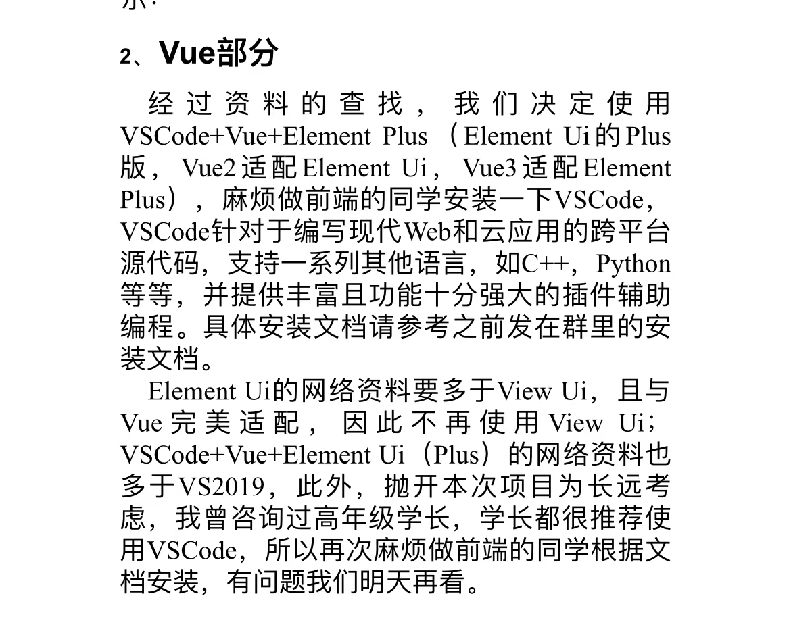

# DatabaseCourseDesign
**代码规范**
1. 一个.cs文件只放一个类
2. 每个人的类都要装到自己的namespace命名空间里，不要出现野生的class
3. 所有类名/函数名/变量名都遵循Pascel命名方式**即所有单词的首字母大写**
- 例如： public class UserInteract{  
    public bool IsValid;  
    public static void UserLogin(){}  
}
4. 添加适当的注释，对于实现核心功能的函数（自己把握就行）**必须**写注释
5. 将代码合理分配到不同的文件夹里，合理布局
6. 所有对代码的注释要么与代码在同一行，要么在代码上面一行
*4.8日补充*
7. 代码文档要求参考[参考文档](后端说明文档规范.md)
    - 每一个类**必须**写这个类内**所有方法的名字、传入参数、功能、返回值类型；所有成员变量的名字、类型；**，可以不写成员变量的作用
    - 对于准备弃用的类/方法：使用(**~~...~~**方式注明，并在其后补充“**拟弃用**”字样)，并注明时间(例：4.8日创建的类方法funcA在4.10日准备更改，则在“**拟弃用**”字样后加上时间,最终呈现的结果应为：<u>funcA</u>(*拟更改*,4.10日))
    - 对于准备更改的类/方法：使用(<u>加入下划线</u>的方式注明，并在其后补充“**拟更改**”字样)，并注明时间，要求同上

**github使用要求**
1. 代码**禁止**直接传到main分支里，先传到分配给你的branch里，经测试后由测试人员merge到main分支里
2. 往github上提交时除了传代码还要传**更新日志**（内容包括但不限于：提交日期、新建了什么类、更改了以前代码里的类哪些成员/函数**的名字**）
3. 每天晚8点（待定）前提交代码到github仓库

**技术栈**
1. 前端 vue 

2. 后端C#
    