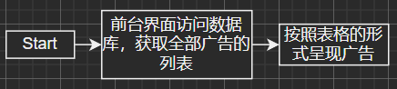
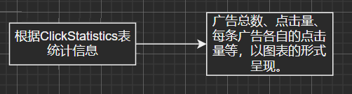
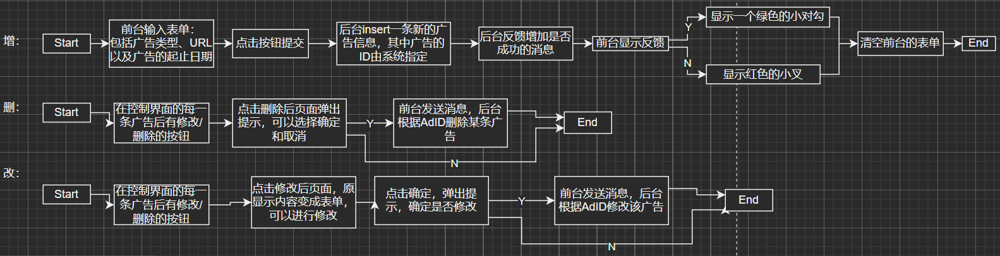
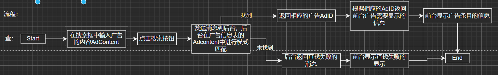
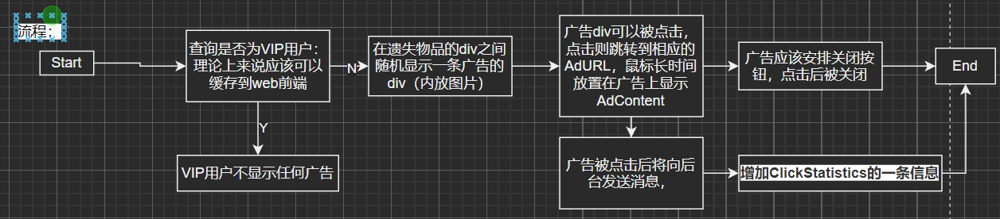
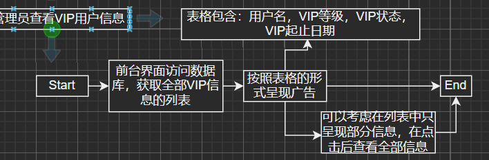
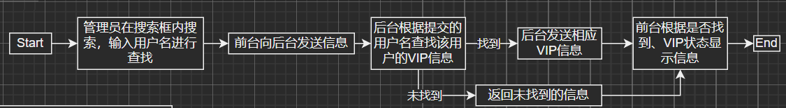
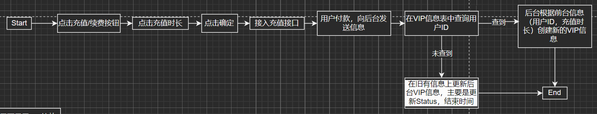
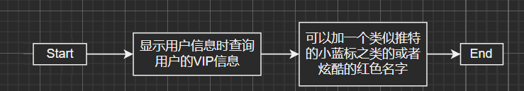

# 用户层面功能
## 1. 用户创建账户以及注册登录
### 涉及到的表
- AuthInfo(用户认证信息表)
    - **认证ID** (AuthID): 唯一标识每个认证记录的主键。系统指定
    - **用户ID** (UserID): 关联的用户ID，外键，关联到Users表的UserID。系统指定
    - **认证方式** (AuthMethod): 认证方式，如邮箱验证、手机验证等。用户选择
    - **认证状态** (AuthStatus): 当前的认证状态，如已验证、待验证等。系统认定
    - **认证日期** (AuthDate): 认证完成的日期。系统认定

## 2. 用户发布寻物启事（用户的个人信息）
**是否要创建两个表，一个是对每一个用户的，一个是所有用户汇总到一起的大表**
### 涉及到的表
- LostItems(遗失物品表)：
    - `ItemID` (物品ID): 主键，系统自动生成。
    - `ItemName` (物品名称): 用户输入
    - `CategoryID` (类别ID): 物品所属的类别，用户*选择*，关联到`ItemCategories`表。
    - `Description` (描述): 用户输入
    - `LostLocation` (遗失地点): 用户输入
    - `LostDate` (遗失日期): 用户输入
    - `UserID` (用户ID): 报失者的ID，标识发布遗失信息的用户，关联到`Users`表。*系统判定*
    - `Status` (状态): 物品的状态，如“正在寻找”。*系统判定*
- ItemImages(物品图片表)：
    - `ImageID` (图片ID): 主键，系统自动生成。
    - `ItemID` (物品ID): 关联的遗失或找回物品的ID，这里会关联到遗失物品。*系统自动生成*
    - `ImageUrl` (图片URL): 存储图片的URL地址。<u>待定</u>
    - `Description` (描述): 用户输入
- ItemTags(物品标签表)和ItemTagLinks(物品-标签关联表)
    - `TagID` (标签ID): `ItemTags`表中唯一标识每个标签的主键。
    - `TagName` (标签名称): `ItemTags`表中标签的名称，用户选择。
    - `ItemID` (物品ID) 和 `TagID` (标签ID): `ItemTagLinks`表中创建物品与标签之间的关联。
- 赏金悬赏表(RewardOffers)<u>用户可选可不选</u>
    - `RewardID` (悬赏ID): 主键，系统自动生成。
    - `ItemID` (物品ID): 关联的遗失物品ID，外键，关联到`LostItems`表。
    - `UserID` (用户ID): 悬赏者的用户ID，外键，关联到`Users`表。
    - `RewardAmount` (悬赏金额): 用户输入
    - `Status` (状态): 悬赏的当前状态，如激活、已领取、取消。系统判定
    - `ReleaseDate` (发布日期): 系统自动提取
    - `Deadline` (截止日期): 用户指定
- ItemStatusHistory(物品状态历史表)
### 待定部分
- 用户输入完成后加一个“是否公开”
    - 若公开，则直接将这个遗失物品写入数据库，status更为“待寻找”
    - 若不公开，则将该物品的status设为“暂存”，不进入展示界面

## 3. 用户发布找到的无主物品信息（用户的个人信息）
### 涉及到的表
- FoundItems(找回物品表)
    - `ItemID` (物品ID): 系统自动生成。
    - `ItemName` (物品名称): 用户输入
    - `CategoryID` (类别ID): 物品所属的类别，用户*选择*，关联到`ItemCategories`表。
    - `Description` (描述): 用户输入
    - `FoundLocation` (找回地点): 用户输入
    - `FoundDate` (找回日期): 用户输入
    - `UserID` (用户ID): 找回物品者的ID，标识提供找到物品信息的用户，关联到`Users`表。
    - `MatchStatus` (匹配状态): 物品的匹配状态，如“待审核”。
- ItemImages(物品图片表)
- ItemTags(物品标签表)
- ItemTagLinks(物品-标签关联表)
- ItemStatusHistory(物品状态历史表)

## 4. 归还物品(这个是紧接着功能2的后续功能)
### 涉及到的表
- MatchRecords(匹配记录表)
    - **记录ID** (RecordID): 唯一标识每个匹配记录的主键。
    - **遗失物品ID** (LostItemID): 遗失物品的ID，外键，关联到LostItems表的ItemID。
    - **找回物品ID** (FoundItemID): 找回物品的ID，外键，关联到FoundItems表的ItemID。
    - **匹配日期** (MatchDate): 匹配的日期。
    - **处理状态** (ProcessingStatus): 记录的处理状态（如：待确认、已完成）。
- ItemClaimProcesses(物品认领流程表)
    - **流程ID** (ProcessID): 唯一标识每个认领流程的主键。
    - **物品ID** (ItemID): 被认领的物品ID，外键，关联到LostItems或FoundItems表的ItemID。
    - **认领用户ID** (ClaimantUserID): 申请认领的用户ID，外键，关联到Users表的UserID。
    - **流程状态** (Status): 认领流程的当前状态，如“待审核”、“审核通过”、“审核拒绝”等。
    - **申请日期** (ApplicationDate): 提交认领申请的日期。
- 遗失物品表 (LostItems)
- 找回物品表 (FoundItems)
- ItemReturnAgreements(物品归还协议表)
    - **协议ID** (AgreementID): 唯一标识每个归还协议的主键。
    - **物品ID** (ItemID): 关联的物品ID，外键，关联到LostItems或FoundItems表的ItemID。
    - **发起用户ID** (FromUserID): 发起协议的用户ID，外键，关联到Users表的UserID。
    - **接收用户ID** (ToUserID): 接受协议的用户ID，外键，关联到Users表的UserID。
    - **协议内容** (AgreementContent): 协议的具体内容和条款。
    - **协议状态** (AgreementStatus): 协议的当前状态，如待确认、已同意、已拒绝。
    - **创建日期** (CreationDate): 协议创建的日期。
- ItemExchanges(物品交换表)
    - **交换ID** (ExchangeID): 唯一标识每个交换记录的主键。
    - **发起物品ID** (InitiatorItemID): 发起交换的物品ID，外键，关联到LostItems或FoundItems表的ItemID。
    - **响应物品ID** (ResponderItemID): 响应交换的物品ID，外键，关联到LostItems或FoundItems表的ItemID。
    - **发起用户ID** (InitiatorUserID): 发起交换的用户ID，外键，关联到Users表的UserID。
    - **交易类型** (TransactionType): 交易的类型，如物品归还、赏金支付等。
    - **响应用户ID** (ResponderUserID): 响应交换的用户ID，外键，关联到Users表的UserID。
    - **交换状态** (ExchangeStatus): 交换的当前状态，如“待响应”、“已接受”、“已拒绝”等。
    - **创建时间** (CreationTime): 交换记录创建的时间。
## 5. 用户发表评论
### 涉及到的表
- ItemComments(用户评论表)
    - `CommentID` (评论ID): 主键，系统自动生成。
    - `ItemID` (物品ID): 评论关联的物品ID，外键，关联到`LostItems`或`FoundItems`表。
    - `UserID` (用户ID): 评论者的用户ID，外键，关联到`Users`表。系统指定
    - `Content` (评论内容): 用户指定。
    - `CommentDate` (评论日期): 系统生成
- 用户表 (`Users`)：虽然用户发表评论主要涉及到`ItemComments`表，但用户的身份（通过`UserID`）从`Users`表获取，确保评论者的身份验证和追踪。此表字段包括但不限于：
    - `UserID` (用户ID): 主键，唯一标识每个用户。
    - `Username` (用户名): 用户的名称。
    - `Contact` (联系方式): 用户的联系方式。
- 遗失物品表 (`LostItems`) 和 找回物品表 (`FoundItems`)中的一个

## 6. 用户个性化设计
### 涉及到的表
- UserPreferences(用户偏好设计表)
    - **偏好ID** (PreferenceID): 唯一标识每个偏好设置的主键。用户指定
    - **用户ID** (UserID): 关联的用户ID，外键，关联到Users表的UserID。系统获取
    - **偏好类型** (PreferenceType): 偏好设置的类型，例如接收通知的方式、匹配项显示偏好等。系统提供
    - **偏好值** (PreferenceValue): 用户设置的偏好值。用户选择/输入
    - **更新日期** (UpdateDate): 偏好设置最后更新的日期。系统指定
- UserSubscriptions(用户订阅表)
    - **订阅ID** (SubscriptionID): 唯一标识每条订阅记录的主键。
    - **用户ID** (UserID): 订阅用户的ID，外键，关联到Users表的UserID。
    - **订阅类型** (SubscriptionType): 订阅的内容类型，如“特定物品类别的新失物登记”、“用户评价更新”等。
    - **订阅状态** (SubscriptionStatus): 订阅的状态，如“激活”、“暂停”等。
    - **创建日期** (CreationDate): 订阅创建的日期。

## 7. 显示用户在网站活跃程度
### 涉及到的表
- UserActivity(用户活跃度表)
    - **活跃度ID** (ActivityID): 唯一标识每条活跃度记录的主键。
    - **用户ID** (UserID): 用户的ID，外键，关联到Users表的UserID。
    - **登录次数** (LoginCount): 用户登录平台的次数。
    - **最后登录日期** (LastLoginDate): 用户最后一次登录的日期。
    - **活跃分数** (ActivityScore): 基于用户活动计算的活跃度分数。
- UserPoints(用户积分表)
    - **积分ID** (PointID): 唯一标识每个积分记录的主键。
    - **用户ID** (UserID): 用户的ID，外键，关联到Users表的UserID。
    - **积分来源** (PointSource): 积分获取的来源，如“物品报失登记”、“成功找回物品”等。
    - **积分** (Points): 获得或消耗的积分数。
    - **日期** (Date): 积分变更的日期。
- UserFeeds(用户动态表)
   - **动态ID** (FeedID): 唯一标识每条动态的主键。
   - **用户ID** (UserID): 发布动态的用户ID，外键，关联到Users表的UserID。
   - **内容** (Content): 动态的具体内容。
   - **发布日期** (PublishDate): 动态发布的日期。
## 8. 与其他用户的交互(社交性质)
### 涉及到的表
- UserMessages(用户消息表)
    - **消息ID** (MessageID): 唯一标识每条消息的主键。
    - **发送者用户ID** (FromUserID): 消息发送者的用户ID，外键，关联到Users表的UserID。
    - **接收者用户ID** (ToUserID): 消息接收者的用户ID，外键，关联到Users表的UserID。
    - **消息内容** (Content): 消息的具体内容。
    - **发送日期** (SentDate): 消息发送的日期和时间。
    - **阅读状态** (ReadStatus): 消息的阅读状态，如已读、未读。
- UserRatings(用户评价表)
    - **评价ID** (RatingID): 唯一标识每个评价记录的主键。
    - **发起用户ID** (FromUserID): 发起评价的用户ID，外键，关联到Users表的UserID。
    - **目标用户ID** (ToUserID): 被评价的用户ID，外键，关联到Users表的UserID。
    - **评分** (Score): 给出的评分，例如1到5。
    - **评论** (Comment): 对目标用户的评论。
    - **评价日期** (RatingDate): 发起评价的日期。
- UserRelationships(用户关系表)
    - **关系ID** (RelationshipID): 唯一标识每对用户关系的主键。
    - **用户ID1** (UserID1): 用户1的ID，外键，关联到Users表的UserID。
    - **用户ID2** (UserID2): 用户2的ID，外键，关联到Users表的UserID。
    - **关系类型** (RelationshipType): 用户之间的关系类型，如“朋友”、“黑名单”等。
    - **建立日期** (EstablishedDate): 关系建立的日期。
- SocialMediaShares(社交媒体分享记录表)
    - **分享ID** (ShareID): 唯一标识每次分享的主键。
    - **用户ID** (UserID): 进行分享的用户ID，外键，关联到Users表的UserID。
    - **物品ID** (ItemID): 被分享的物品ID，外键，关联到LostItems或FoundItems表的ItemID。
    - **平台** (Platform): 分享到的社交平台，如Facebook、Twitter等。
    - **分享日期** (ShareDate): 分享发生的日期。
## 9. 提问与答疑
### 关联的表
- QnA(问答表)
    - **问答ID** (QnAID): 唯一标识每个问答记录的主键。
   - **提问用户ID** (AskerUserID): 提出问题的用户ID，外键，关联到Users表的UserID。
   - **回答用户ID** (AnswerUserID): 回答问题的用户ID，可为空，外键，关联到Users表的UserID。
   - **问题** (Question): 提出的问题。
   - **回答** (Answer): 对问题的回答。
   - **提问日期** (AskDate): 提问的日期。
   - **回答日期** (AnswerDate): 回答的日期，可为空。

# 网站管理层面的功能
## 1. 网站维护方面
### 涉及的表
- SystemLogs(系统日志表)
    - **日志ID** (LogID): 唯一标识每条系统日志的主键。
    - **操作类型** (OperationType): 发生的操作类型，如系统维护、数据备份、异常报告等。
    - **操作详情** (OperationDetails): 操作的具体详情。
    - **操作用户ID** (UserID): 执行操作的用户ID，可以为空，外键，关联到Users表的UserID。
    - **操作日期** (OperationDate): 操作发生的日期和时间。
- APIAccessLogs(API访问日志表)
    - **访问ID** (AccessID): 唯一标识每次API访问的主键。
    - **API名称** (APIName): 被访问的API名称或标识。
    - **访问者标识** (AccessorID): 访问者的标识，可能是用户ID或第三方应用ID。
    - **访问时间** (AccessTime): API被访问的时间。
    - **访问结果** (AccessResult): API访问的结果，如“成功”、“失败”、“错误代码”。
- ScheduledTasks(定时任务表)
    - **任务ID** (TaskID): 唯一标识每个定时任务的主键。
    - **任务类型** (TaskType): 定时任务的类型，如“数据备份”、“报表生成”等。
    - **任务状态** (TaskStatus): 任务的执行状态，如“待执行”、“执行中”、“已完成”等。
    - **执行时间** (ExecutionTime): 定时任务执行的时间点。
    - **任务详情** (TaskDetails): 任务的详细描述或执行参数。
- SecurityEvents(安全事件记录表)
    - **事件ID** (EventID): 唯一标识每个安全事件的主键。
    - **事件类型** (EventType): 安全事件的类型，如“账户异常登录”、“数据泄露”等。
    - **事件详情** (EventDetails): 事件的详细信息。
    - **处理状态** (Status): 事件的处理状态，如“已解决”、“待处理”等。
    - **发生日期** (OccurrenceDate): 事件发生的日期。
## 2. 用户管理方面
### 涉及的表
- NotificationLogs(通知记录表)
    - **通知ID** (NotificationID): 唯一标识每个通知的主键。
    - **用户ID** (UserID): 要通知的用户ID，外键，关联到Users表的UserID。
    - **通知类型** (NotificationType): 通知的类型，如“物品匹配通知”、“系统通知”等。
    - **发送日期** (SentDate): 通知发送的日期和时间。
    - **状态** (Status): 通知的状态，如已读、未读。
- UserActivityLogs(用户行为日志表)
    - **行为日志ID** (ActivityLogID): 唯一标识每条用户行为记录的主键。
    - **用户ID** (UserID): 行为发起者的用户ID，外键，关联到Users表的UserID。
    - **行为类型** (ActivityType): 用户行为的类型，如“登录”、“发布物品”、“评论”等。
    - **行为详情** (ActivityDetails): 行为的详细描述。
    - **发生时间** (Timestamp): 行为发生的具体时间。
- RecommendationLogs(推荐系统日志表)
    - **日志ID** (LogID): 唯一标识每条推荐日志记录的主键。
    - **用户ID** (UserID): 接受推荐的用户ID，外键，关联到Users表的UserID。
    - **推荐内容** (RecommendedContent): 推荐的内容详情。
    - **推荐时间** (RecommendationTime): 推荐发生的时间。
    - **用户反馈** (UserFeedback): 用户对推荐内容的反馈，如“有用”、“无用”。
- DataAnalysisReports(数据分析报表)
    - **报表ID** (ReportID): 唯一标识每个报表记录的主键。
    - **报表类型** (ReportType): 报表的类型，如“用户活跃度分析”、“物品找回率统计”等。
    - **报表数据** (ReportData): 报表的具体数据内容，可能包含文字、数字或图表等。
    - **生成日期** (GenerationDate): 报表生成的日期。
- TransactionLogs(交易记录表)
    - **TransactionID** (交易ID): 主键，唯一标识每笔交易。
    - **FromUserID** (发起方用户ID): 发起交易的用户ID，外键，关联到**Users**表。
    - **ToUserID** (接收方用户ID): 接收交易的用户ID（如果适用），外键，关联到**Users**表。对于系统收费等情况，此字段可能为空或指向一个特定的系统账户。
    - **ItemID** (物品ID): 交易相关的物品ID（如果适用），外键，关联到**LostItems**或**FoundItems**表。不是所有交易都与物品直接相关，因此，这个字段在某些记录中可能为空。
    - **Amount** (金额): 交易金额。根据交易的性质，这可以是正数（如支付赏金、购买服务）或负数（如退款）。
    - **TransactionType** (交易类型): 描述交易类型的字符串，如"赏金支付"、"服务购买"、"退款"等。
    - **Status** (状态): 交易的当前状态，如"进行中"、"完成"、"失败"等。
    - **TransactionDate** (交易日期): 记录交易发生的日期和时间。
    - **Description** (描述): 关于交易的额外信息或备注，例如交易的具体目的或原因。

### 广告系统

1. 管理员控制界面呈现广告条目

2. 管理界面广告信息统计

3. 管理员增删改广告

4. 管理员查找广告

5. 用户界面呈现广告

### VIP系统(登记系统，评价系统)

1. 管理员查看VIP用户信息

2. 管理员查找用户VIP信息

3. 管理员（更高级）增删改用户VIP信息

4. 用户充值VIP

5. 用户界面显示VIP特效

### 审核系统

