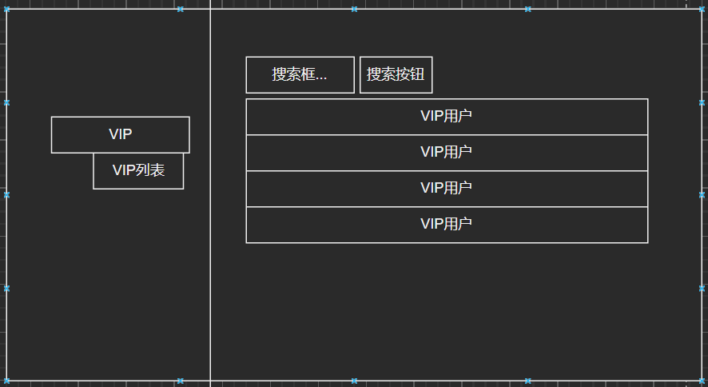
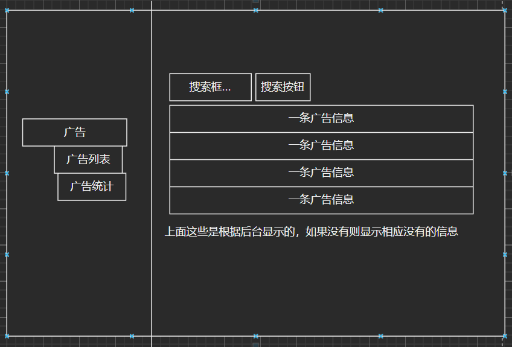
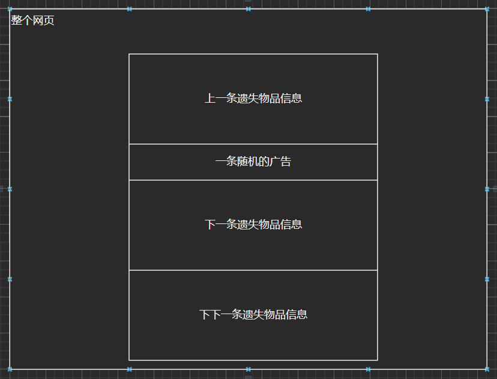

# 第一小组前端需要

## VIP功能

- VIPInformation.html：用于显示所有VIP信息列表（管理员可见）

- VIP用户特效（红名或者小皇冠标记，暂定红名）
- 普通用户/VIP用户界面上需显示充值/续费的按钮
- VIPCharge.html：VIP充值界面（提供充值时长，并且需要连接充值接口）

## 广告功能

- AdInformation.html：显示所有广告列表（管理员可见）

- AdStatistics.html：显示广告统计信息（管理员可见）

这些图表根据广告的点击量信息制作

- 广告显示盒子：用户界面显示广告信息

或者浮动在两边也可以。

## 用户交互功能与Q&A功能

1. 用户动态页
   * 用户信息
   * 内容信息
   * 热度信息
   * 转发数量信息
2. 用户信息页
   * 关注信息
   * 粉丝信息
   * 关系信息：关系信息中显示关系和建立关系的对象
3. 用户消息页
   * 显示整组消息
   * 单个消息显示如微信，点进会话显示消息，并且显示消息的发送时间和状态信息（已读未读等）
   * 请求信息，发送方单独设置成框状，接收方相同设置 但是加上同意和拒绝选项
   * 用户可以通过图标进入消息页面，图标显示未读消息
4. 报错的弹窗信息
   * 简洁为主，设置取消的X键

## 用户发发表评论
1. 每个帖子下方都应有***评论键***
2. 点击评论键后出现***评论框***，可输入文字，但是输入框下方提供一个字数记录***80/100***，并在字数达到100时发出提醒，达到限制
3. 完成文字输入后，评论框下方有***发表键***，点击即可发表
4. 点击发表后，当前页面马上刷新，更新出本评论（如果有审核机制，则，要显示***待审核***，且仅限发表者查看）
5. （审核通过后），评论所有人可见，并且显示出***评论者的头像、昵称、评论内容、评论日期***，同时提供***评论键***（用于对该评论进行评论）
6. 评论者本人点击此评论，可出现***删除键***
7. 用户要对评论进行评论时，点击他人的评论旁的评论键，进行上述流程，但是文本中会自动出现@xxx

## 显示用户在网站活跃度
1. 活跃度及动态均在***个人主页***中查看
2. 用户可***设置他人是否可见***
3. 个人主页中***一栏为：活跃度：xx***，用于显示整体活跃度
4. 用户点击这个后，出现近期每条活跃度的变化，可以是***点击后活跃度栏下拉出现,也可以是一个新的网页***，每条活跃度显示出，***活跃行为，活跃度变化量（+1/-1），发生日期时间***
5. 个人主页中***一栏为：最近动态***
6. 点击该栏，则出现***用户发表的动态由最近发表到最早发表的顺序展示***，每条动态展示：***动态种类（评论/帖子），动态内容，发布时间***
7. 点击每条动态，都能打开***对应帖子所在网页***，并对***动态内容进行加亮处理***

# 归还物品

## 待商榷部分最终结果

+ 物品归还协议表：协议内容每一个都是一样的，不需要放在表格中，但是已阅读或者没阅读的状态可以放在表里。

+ 物品交换表：可以加入用钱购买物品而不只是以物易物（需要链接到外部平台）

## 需要的前端元素：

+ 按钮：点击“这是我的物品”按钮

+ 网页：跳转到“物品确认”界面

  + 首先进行系统自动匹配----->流程状态变更

  + 自动匹配失败则失主进行相关信息回答（如在何处丢失，里面有什么东西等），由捡到物品者审核---->流程状态变更

+ 网页：审核通过则跳转到“物品归还”界面
  + 阅读物品归还协议（可以做成网页或弹窗）----->阅读状态变更
  + 双方进行协议状态确认---->协议状态变更

+ 网页：审核不通过或长期无人认领状态或者失主不要了，可跳转到“商品市场”

  + 用户可以通过导航栏或者跳转进入

  + 可以查找需要的东西导航栏

+ 网页：双方确认归还或者已经卖/交换出，后跳转回物品主界面
  + 失物招领流程结束，物品下架，不在推送变成灰色---->处理状态变更

# 用户个性化设计部分：

## 待商榷部分最终结果：

+  偏好类型表：关联订阅表

+ 订阅ID：先不去掉了

+ 用户订阅表中的订阅类型：做成一个表，然后外码关联

## 需要的前端元素

+ 按钮：导航栏需要一个特定的“用户”按钮

+ 按钮：在主界面进行一个“用户个性化”按钮

+ 网页：点击则跳转到“我的偏好”界面

  + 可以选择偏好类型表中的所有信息（都做成按钮）

  + 可以选择订阅状态表中的所有信息（都做成按钮）

# 发布寻物启事
## 需要的前端元素

a、按钮：用户点击进入发布寻物启事的页面。
b、表单：用户进入发布寻物启事的页面后，出现一个表单，用户填写物品名称（文本框）、类别（选择，下拉菜单）、描述（文本框）、遗失地点（文本框），遗失日期（下拉菜单选择日期），选择标签（多选按钮），系统审核这张表单，如果通过填写下一张，否则重新填写。
c、表单：用户在这张表单添加图片（点击图片框添加图片），输入描述（文本框），系统审核这张表单，如果通过填写下一张，否则重新填写。
d、表单：用户选择是否赏金（单选按钮），根据用户选择决定接下来的内容，选择否，接下来是一个提交按钮，用户点击按钮，系统审核这张表单，如果通过提示填写完成，否则重新填写。
选择是，接下来是一个表单，用户输入悬赏金额（文本框），截止日期（下拉菜单），接下来是一个提交按钮，用户点击按钮，系统审核这张表单，如果通过提示填写完成，否则重新填写。

# 发布无主物品信息：
## 需要的前端元素

a、按钮：用户点击进入发布发布无主物品信息的页面。
b、表单：用户进入发布发布无主物品信息的页面后，出现一个表单，用户填写物品名称（文本框）、类别（选择，下拉菜单）、描述（文本框）、找到地点（文本框），找到日期（下拉菜单选择日期），选择标签（多选按钮），系统审核这张表单，如果通过填写下一张，否则重新填写。
c、表单：用户在这张表单添加图片（点击图片框添加图片），输入描述（文本框），接下来是一个提交按钮，用户点击按钮，系统审核这张表单，如果通过提示填写完成，否则重新填写。

# 审核系统

## 需要最终确认的问题：无.

## 前端元素需求：

​	**用户端：**用户端在个人中心内可以查看所有状态的物品，设计一个**筛选器**，可以选择物品的标签、遗失/找回物品、审核状态；显示为**Rejected**的物品在Rejected字样右侧新增一个<u>**修改**</u>按钮，可以让用户直接修改物品相关信息。

​	**管理员端：**应设计一个**管理终端**，其中设置若干按钮（？），比如审核、新增物品、查看日志等等。对于审核，设计两个页面，第一个页面以列表的方式显示所有物品，自动筛选为Pending的物品，显示物品的图片（缩略图）、名称、标签、描述、发布时间、发布用户，设置有三个按钮：<u>**详情、通过、拒绝**</u>，也可以通过筛选器快速筛选其他状态的物品，可以驳回已经**通过**的物品，点击**拒绝**按钮后弹出一个输入框，需要管理员输入**拒绝理由**；第二个页面为点击详情后的页面，显示该物品的所有信息，左上方设置一个**返回**按钮，下方设置四个按钮：上一个、通过、拒绝、下一个。

# 用户注册

### 前端元素

* 登录界面，包括
  1. 用户名
  2. 密码
  3. 验证码（？）
* 注册界面，包括
  1. 自定义用户名
  2. 自定义密码栏
  3. 确认密码栏
  4. 实名认证栏
* 认证界面，包括
  1. 姓名
  2. 身份证号
* 注销界面，包括
  1. 用户名
  2. 密码
  3. 确认注销按钮
  4. 确认注销信息提示
* 关联界面
  1. VIP界面
  2. 个人信息界面，包括
     1. 头像（？）
     2. 用户名
     3. 用户ID
     4. VIP等级信息
     5. 是否实名认证