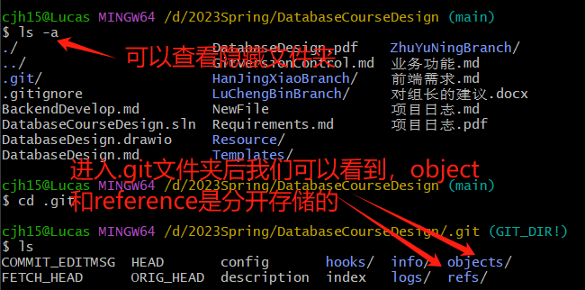
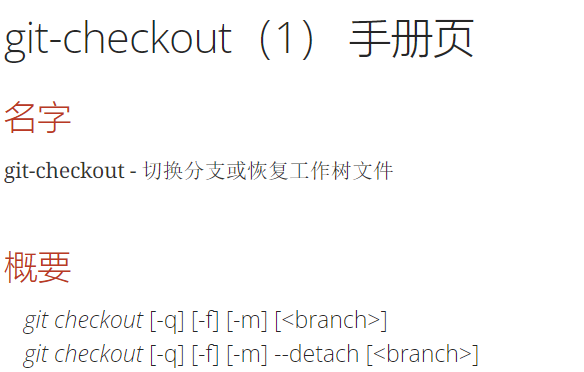
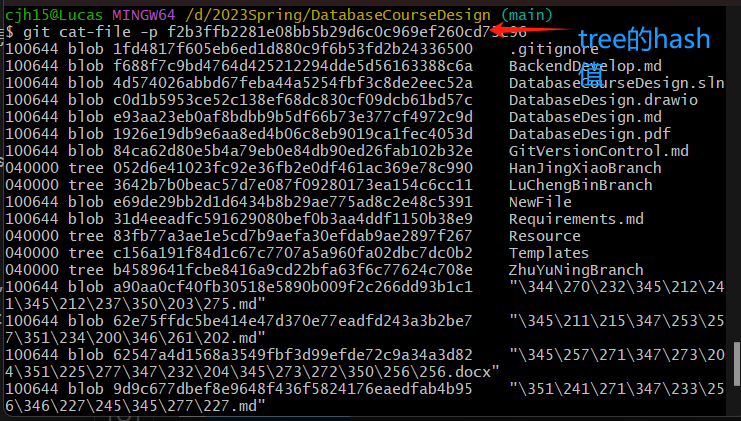
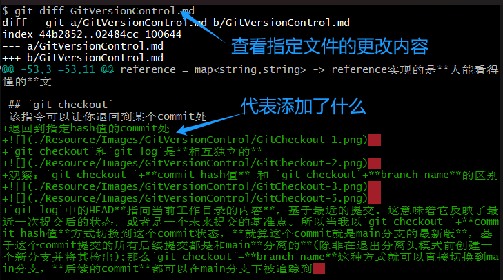
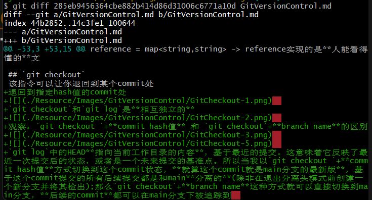
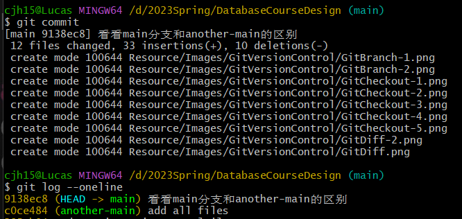
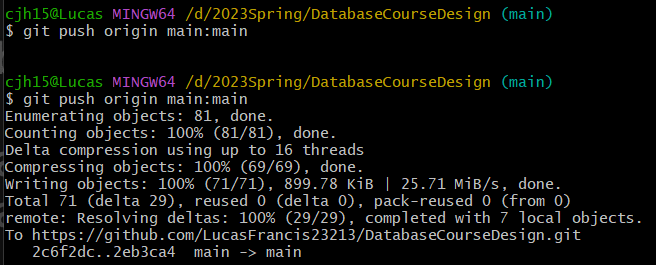

  

该文档基于[MIT课程](https://missing.csail.mit.edu/2020/version-control/)
## 在git中，文件、文件夹、commit都是怎么组成的？
### 文件(blob)
typeof(blob) = array<byte> -> **一个文件是bit组成的数组**  
### 文件夹(tree)
typeof(tree) = map<string, tree | blob> -> 文件夹实际上是一个字典/哈希图；string代表文件名，tree|blob代表这个名下的文件/文件夹的内容
### **commit**
typeof(commit) = struct{  
     parents = array<commit> # 代表该commit的历史记录,数组形式存储    
     author,message等meta data  
     snapshot = tree  
}  

## git是如何处理这三种数据结构的
### git**平等对待上述的数据结构**
type object = blob | tree | commit -> 数据类型object就是“平等”的体现  
ObjectStorage = map<string,object>  
如果把文件/文件夹/commit提交到ObjectStorage，**实际上是对字典/哈希表进行添加操作**，写入到硬盘里；取文件就跟从哈希表里取是一样的  

reference = map<string,string> -> reference实现的是**人能看得懂的**文件名到**16进制的文件哈希值**的映射关系  

### git仓库的组成
  

# git指令
## `git help` 
输入`git help <git-command>`("<git-command>"代表对哪个git指令进行提问)  
图片中对`checkout`指令进行提问  
  
输入后会打开一个操作指南窗口  
  

## `git status`
该指令可以查询当前我的git状态  
  

## `git commit`  
该指令会创建一次提交  
  
只使用`git commit`后会跳转到vim文本编辑器创建commit信息，如果用不习惯vim可以使用指令`git config --global core.editor "nano"`换成nano编辑器  
如果使用`git cat-file -p <commit-hash>`，我们就能看到这个commit的**完整的提交信息**  
  
同理，也可以通过`git cat-file -p <tree-hash>/<parent-hash>`查看该commit的**tree是谁**以及这个commit的**历史提交**  
  
  

## `git log`
该指令可以查看提交的记录  
`git log --all --graph --decorate`可以将log按时间先后呈现出来  
  
输入wq退出(跟退出vim编辑器是一样的)  

## `git checkout`  
该指令可以让你退回到某个commit处  
退回到指定hash值的commit处  
  
`git checkout`和`git log`是**相互独立的**  
  
观察：`git checkout <commit-hash>` 和 `git checkout <branch name>` 的区别  
  
  
`git log`中的HEAD**指向当前工作目录的内容**，基于最近的提交。这意味着它反映了最近一次提交后的状态，或者是一个未来提交的基准点。所以当我以`git checkout <commit-hash>`方式切换到这个commit状态，**就算这个commit就是main分支的最新版**，基于这个commit提交的所有后续提交都是和main**分离的**(除非在退出分离头模式前创建一个新分支并将其检出);那么`git checkout <branch name>`这种方式就可以直接切换到main分支，**后续的commit**都可以在main分支下被追踪到  

### **当然切换分支也可以使用`git switch <branch-name>`实际上使用这个指令切换分支更安全**

## `git diff`
该指令可以查看两次提交中到底改变了什么内容  
**缺省情况下**，`git diff`比较的是**当前工作区**和**HEAD指向的commit**的内容差异  
  
如果要查看**某次commit提交后某个文件改了什么**，可以使用`git diff <commit-hash> <file-name>`，这就相当于把HEAD改为了某次提交  
  
`git diff`实际上可以接受两个参数，`git diff <commit-hash-1> <commit-hash-2> <file-name>`，这个指令代表从`<commit-hash-1>`到`<commit-hash-2>`之间`<file-name>`这个文件做了哪些改变  

## `git branch`
该指令会列出本地的所有分支  
  
`git branch <branch-name>`指令会基于当前HEAD所指的内容创建一个新的平行分支  
  
  
`git branch --set-upstream-to=<remote-repo-name>/<remote-branch>`，该指令可以设定push时缺省状态下会提交到哪个远程分支  

## `git merge`
该指令可以视为`git branch`的反操作，`git branch`是创建分支的，`git merge`是合并分支的  
在**切换分支/合并分支**前，如果没有将本分支**正在被追踪(tracked)文件添加到暂存区(staging area)**，会报错  
  
使用`git add <file-name>`将文件添加到**暂存区**  
  
现在合并就没问题了  
  
如果我所处的分支和我要合并的分支存在**父子关系**，那么合并流程就是**移动HEAD指针到合并的分支处**  
merge前两分支的状态：  
  
merge后两分支的状态，**观察HEAD的变化：**  
  
**如果存在合并冲突(merge conflicts)，VSCODE/VISUAL STUDIO会有“合并冲突管理器”的东西专门用于合并冲突**  

## `git remote`
该指令可以添加、查看、删除远程仓库
`git remote add <human-readable-name> <repository-url>`指令可以为当前本地git仓库添加远程仓库,*远程url也可以是本机的地址*  
`git remote -v`指令可以查看当前仓库的远程信息  
  

## `git push`
该指令可以将本地代码推送到远程仓库
`git push <remote-repo-name> <local-branch>:<remote-branch>`
  

## `git clone`
`git clone <remote-url> <local-folder>`，该指令可以将该url链接的文件克隆到指定的本地文件夹  
`git clone --shallow`这个指令**只会拉取最新版的提交**，上面的则会把**所有的版本都拉取下来**  

## `git blame`
`git blame <file-name>`该指令可以查看谁在什么时候改了这个文件，以及更改的具体内容  
  

上面只是我们这个项目应该会用到的git指令  
# 每次开完会后的工作流  
- 开完会之后组长会把会议记录和相关资料更新到`main`分支上  
- 各位组员**先拉取**`main`分支，看这周的任务是什么、具体有什么标准和要求、什么时候ddl  
- 具体做任务前，**先看说明文档/会议记录里的要求**  
- **在此基础上**，如果不清楚做什么/认为文档没写清楚直接私信组长/大群里at他就行  