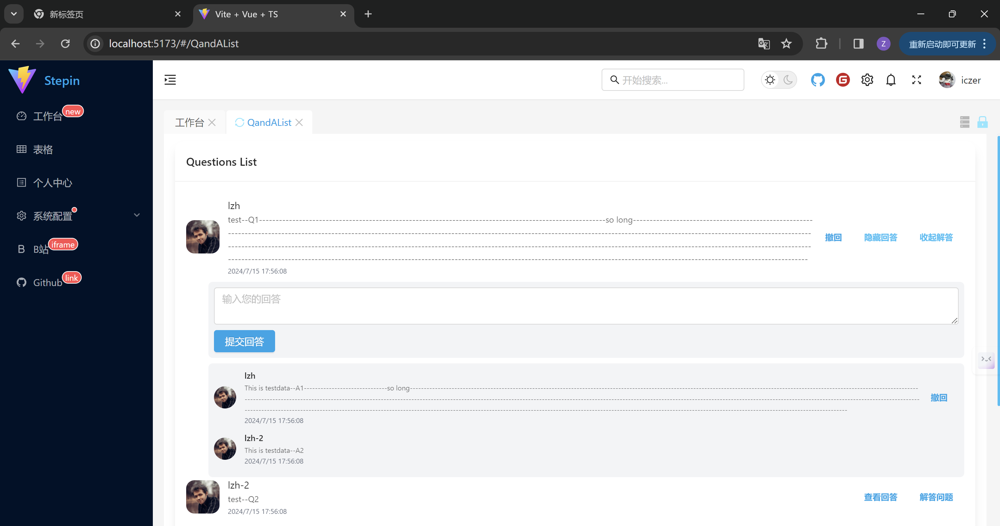
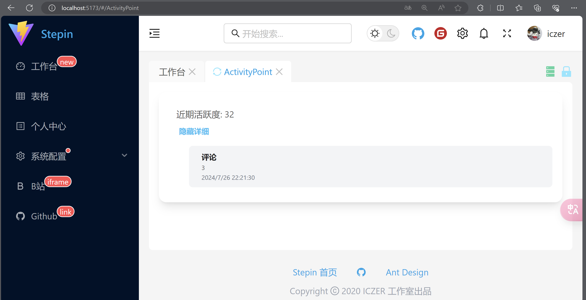

# 第一周开发总结

lzh: 实现了用户问答模块的前端
- 样式效果在google浏览器中如图
  - 
  - 
- 功能简述：
  - 问题列表展示(包括个人信息与发表时间)和提交问题
  - 对问题回答列表展示和提交回答
  - 对于自己发表的问题或回答进行撤回

# 第二周开发总结

lzh: 实现了用户评论模块的前端、用户活跃度模块的前端
- 样式效果(edge浏览器):
  - 
  - 
- 功能简述：
  - 评论列表展示(包括个人信息与发表时间)和提交评论
  - 对自己发表的评论进行撤回
  - 近期活跃度展示并对近期活跃行为列表展示