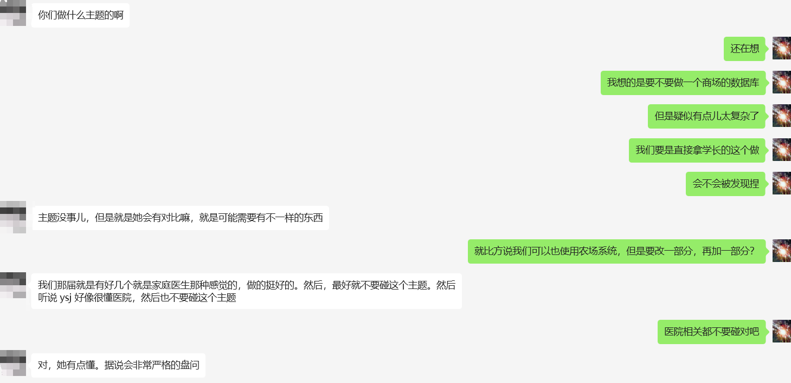
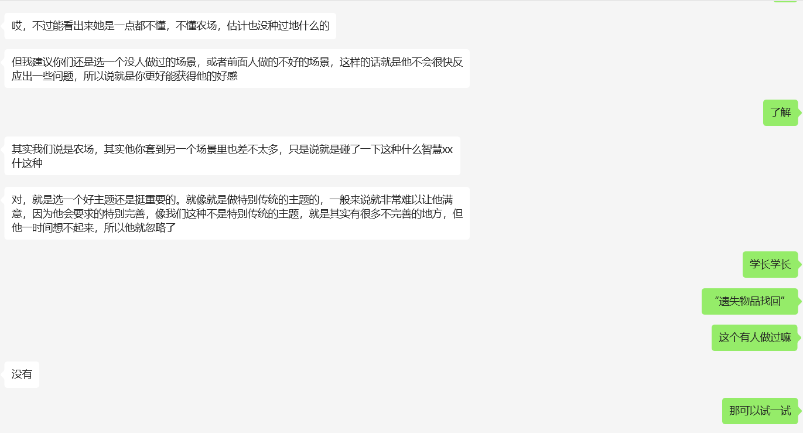

**3.30日日程**
1. 讨论数据库如何设计（依照学长的项目）
[农场项目](./Resource/Files/FarmManagement.pdf)

2. 分配工作，包括前端、后端、测试、项目整体架构、构建数据库  

3. 人员怎么配置（怎么合作，避免前后端合不起来）  

4. 前端学vue&node js，后端学C#，负责构建项目的同学把讨论结果以流程图的方式提供给前/后端同学，以便代码实现
5. 项目评分如下

6. 加分与扣分  
    6.1 允许摆烂**2次**，即两次 相邻开会间不推进项目  
    6.2 允许开会时人不在**2次**，但是别人替你汇报  
    6.3 上述机会用完后，**不接受任何形式请假，直接扣成绩**  
    6.4 代码需要经常返工，扣分(**因需求改变导致的反工不算**)  
    6.5 代码复用性强，结构清晰 加分  
    6.6 在完成自己的工作后辅助别人完成工作 加分  

**4.7号前的目标**
1. 所有人配置好Oracle数据库
2. 前端人员依据这个“FrontEndDevelop”学习并配置vscode
[前端开发](./Resource/Files/FrontEndDevelop.pdf)
3. 后端开发人员根据“.net开发文档”学习并配置vs2022
[后端开发](./Resource/Files/BackendDevelop.pdf)
4. 确定项目布局与人员分配
5. ~~确定数据库设计思路~~

**4.7日程**
1. ~~确认所有人的Oracle数据库是否成功安装~~(zyn lrb未完成)
2. ~~确定数据库主题(目前想法是遗失物品找回)~~ (主题：遗失物品找回)

3. 准备画E-R图？

**4.7日任务**
1. 检查数据库架构是否合理（是否有可以删除的/合并的/补充的表）
2. 找数据来源（chatgpt）
3. 准备画E-R图
4. 学习VUE

**4.14日程**
1. 讲明代码文档的要求(从github上拉取自己看)
2. ~~确定数据库结构，所有人提交一份反馈(证明你确实看过这个数据库有什么表、表的设计)~~
3. 这周任务安排：
- 业务功能的具体实现(数据库操作级)，<u>**deadline：4月24日 23:59**</u>
    - **4月20日提交初版到*待定*分支**
    - <u>韩敬霄</u> 李彤 李紫浩  
        - 广告/VIP  
        - 用户发表评论  
        - 显示用户在网站活跃程度  
        - 与其他用户的交互(社交性质)  
        - 提问与答疑  
    - <u>陆诚彬</u> 刘佳朋 李若冰  
        - 审核系统  
        - 用户发布寻物启事  
        - 用户发布找到的无主物品信息  
        - 归还物品  
        - 用户个性化设计  
    - <u>朱雨凝</u> 段培裕 杨煊赫  
        - 用户注册  
        - 网站维护  
        - 用户管理  
- 陈佳浩 Oracle数据库部署到服务器，调整表设计，前端代码规范
